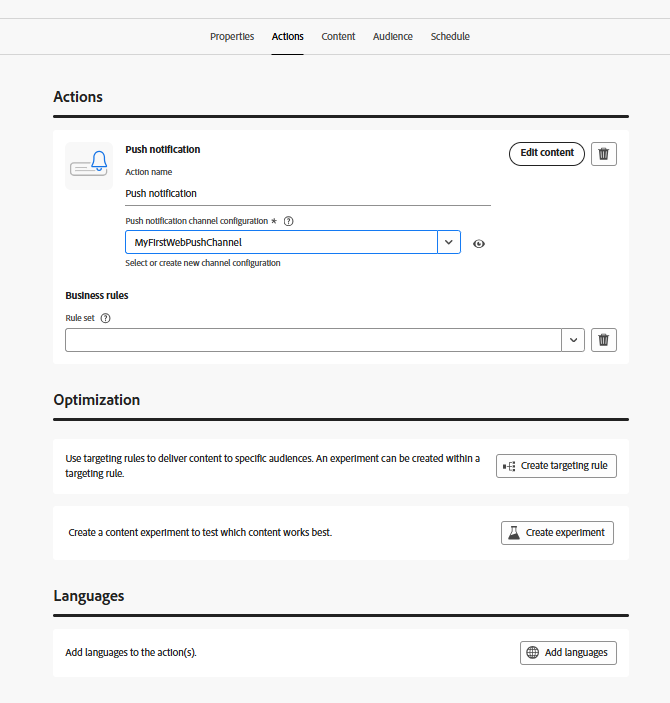

# 캠페인 만들기

이 단계에서는 Adobe Journey Optimizer에서 캠페인을 만들어 옵트인한 사용자에게 예약된 웹 푸시 알림을 보냅니다. 캠페인은 적격 대상자를 타겟팅하고 사전 정의된 시간에 메시지를 전달하여 계획 및 대상자 기반 참여를 활성화합니다.

* Journey Optimizer에 로그인
* 여정 관리 | 캠페인 | 캠페인 만들기 로 이동합니다.

## 캠페인 설정 지정

캠페인 이름 지정

## 작업을 캠페인과 연결

이 자습서에서 이전에 만든 푸시 채널 구성을 연결합니다.

## 대상자와 캠페인 연결

대상자 `AudienceForPush`을(를) 캠페인과 연결

## 푸시 알림을 위한 콘텐츠 만들기

푸시 알림을 테스트하기 위한 기본 푸시 콘텐츠 만들기 아래와 같이 메시지의 제목과 본문을 지정합니다

## 캠페인 예약

필요에 따라 캠페인 예약

마지막으로 캠페인을 활성화했는지 확인하십시오.

## 캠페인 테스트

캠페인을 테스트하려면 먼저 메시지가 표시되면 [을(를) 선택하여 &#x200B;](http://localhost:3000)웹 페이지에서 알림을 활성화하십시오. 옵트인한 후에는 예약된 시간에 캠페인이 실행될 때까지 기다리십시오. 캠페인이 실행되면 브라우저에서 푸시 알림을 수신해야 합니다.

