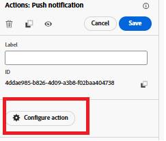

# 여정 만들기

이 단계에서는 사용자 지정 price.drop 이벤트에 의해 트리거되는 Adobe Journey Optimizer의 여정을 만듭니다. 이 이벤트가 수신되면 여정이 실시간으로 시작되고, 옵트인한 사용자에게 푸시 알림이 전송되어 이벤트 기반 참여가 활성화됩니다.

price.drop 이벤트에서 트리거되는 여정을 만들려면 다음 단계를 따르십시오

* Journey Optimizer에 로그인
* 여정 관리 | 여정 | 여정 만들기 로 이동합니다.

## PriceDropEvent 추가

이벤트 섹션의 `PriceDropEvent`을(를) 캔버스로 드래그합니다.

## 푸시 동작 추가

작업 섹션을 확장합니다. `Action` 활동을 캔버스에 끌어다 놓고 작업 유형으로 [푸시]를 선택하십시오.

## 푸시 작업 구성

푸시 알림 활동을 선택하고 작업 구성 을 클릭합니다.

## 푸시 알림 채널 구성

자습서에서 이전에 만든 `MyFirstWebPushChannel` 구성을 이 푸시 알림과 연결

## 푸시 알림 메시지 작성

개인화 편집기를 사용하여 푸시 알림에 정적 및 동적 콘텐츠의 조합을 추가하여 메시지를 보다 매력적이고 연관성 있게 만듭니다.

메시지 작성을 시작하려면 `Content`을(를) 클릭하여 콘텐츠 탭을 엽니다. 이 탭에서 고정 텍스트와 이벤트 데이터에서 파생된 동적 필드를 모두 정의할 수 있습니다.

푸시 메시지의 제목을 지정한 다음 개인화 편집기를 열어 메시지 본문을 구성합니다. 콘텐츠에는 가격이 하락한 제품의 이름이 동적으로 포함됩니다. 이렇게 하려면 각 [도우미 함수](https://experienceleague.adobe.com/en/docs/journey-optimizer/using/content-management/personalization/functions/helpers#each)를 사용하십시오.
제품 목록을 반복하고 메시지 내에서 해당 이름을 렌더링합니다.

## 메시지 본문 구성

도우미 함수 메뉴에서 `Each` 함수를 선택하고 삽입하십시오.

컨텍스트 특성 선택 | Journey Orchestration | 이벤트 | PriceDropEvent | productListItems | 이름

개인화 편집기 내의 각 루프에 배열을 삽입하려면 &quot;+&quot; 아이콘을 클릭합니다. 그런 다음 참조 스크린샷에 표시된 포맷과 일치하도록 메시지 콘텐츠를 업데이트합니다. 환경에 표시되는 이벤트 ID는 표시된 이벤트 ID와 다를 수 있습니다.

마지막으로, 모든 변경 사항을 저장하고 여정을 게시합니다. 게시되면 여정이 활성화되고 incoming price.drop 이벤트를 수신합니다. 이러한 이벤트가 수신될 때마다 여정이 실시간으로 트리거되고, 알림을 받도록 선택한 사용자에게 푸시 알림이 전송되어 적시에 적절한 참여가 보장됩니다.

## 솔루션 테스트

price.drop 이벤트를 트리거하려면 [가격 하락 트리거 페이지를 열고](http://localhost:3000/price-drop-trigger.html) 하나 이상의 제품을 선택한 다음 가격 하락 트리거를 클릭합니다. 이렇게 하면 AEP 태그를 사용하여 Adobe 데이터 레이어를 통해 이벤트를 전송한 다음 여정을 시작하고 푸시 알림을 실시간으로 전달합니다.

