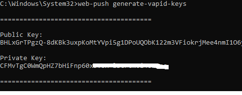

# 푸시 채널 만들기

첫 번째 단계는 Adobe Journey Optimizer에서 푸시 채널을 만드는 것입니다. 이 설정의 일부로, 웹 푸시 알림을 인증하고 활성화하는 데 필요한 VAPID 키를 생성해야 합니다. 그런 다음 푸시 채널 구성에 이러한 키를 사용하여 AJO에서 구독한 사용자에게 알림을 안전하게 전송할 수 있습니다.

## VAPID 키 생성

VAPID(자발적 애플리케이션 서버 식별)는 서버가 공개/개인 키 쌍을 사용하여 푸시 서비스(Chrome, Edge 등)에 대해 자신을 식별할 수 있는 웹 푸시 표준이므로 푸시 제공자는 누가 알림을 전송하는지 알 수 있습니다.

푸시 메시지를 인증하고 안전하게 전송하기 위해 함께 사용되는 공개 키(브라우저와 공유)와 개인 키(서버에 유지됨)를 만드는 웹 푸시 생성-vapid-key와 같은 도구를 사용하여 생성됩니다.

이 자습서에서는 Node.js를 사용하여 VAPID 키를 생성했습니다.

Node.js가 설치되어 있는지 확인합니다. 그런 다음 다음 다음 명령을 실행합니다
```npm install web-push -g ```


```web-push generate-vapid-keys```



## 푸시 자격 증명 만들기

* Journey Optimizer에 로그인

* 관리 | 채널 | 푸시 설정 | 푸시 자격 증명| 푸시 자격 증명 만들기로 이동합니다.

* 

## 채널 구성 만들기

* Journey Optimizer에 로그인

* 관리 | 채널 | 채널 구성 만들기 로 이동합니다.
  
