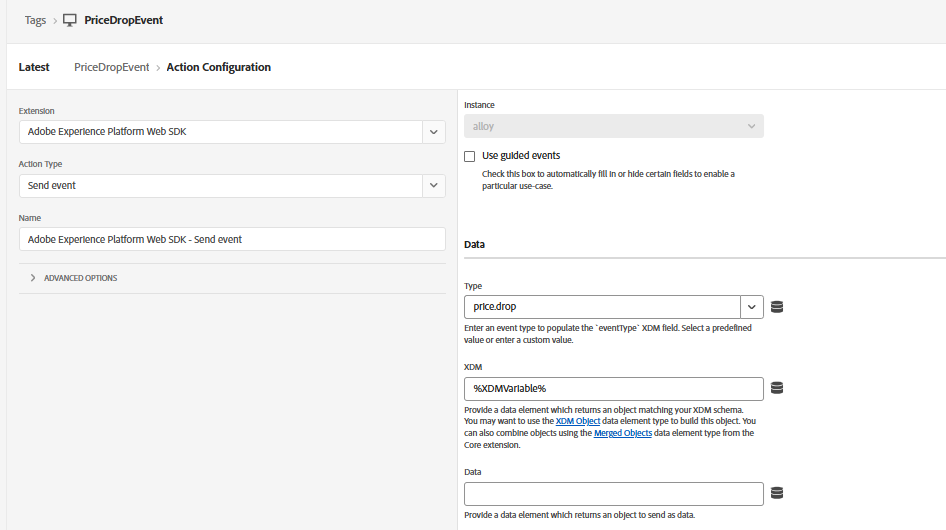

# 태그 속성 만들기

이 자습서의 두 번째 부분에서는 사용자 지정 price.drop 이벤트를 수동으로 전송하여 실시간으로 푸시 알림을 트리거하는 방법을 알아봅니다. 이 접근 방법에서는 AEP 데이터 수집(태그)을 사용하여 웹 페이지에서 이벤트를 캡처하여 Adobe Experience Platform으로 보냅니다. 이벤트가 수집되면 Adobe Journey Optimizer에서 여정을 트리거하여 사용자 작업 또는 비즈니스 이벤트에 따라 요청 시 푸시 알림을 전송할 수 있습니다.

이 속성은 자습서에서 이전에 만든 `WebPushDataStream`에 연결된 AEP Web SDK으로 구성됩니다. Tag 속성은 Adobe 데이터 레이어에서 `price.drop` 이벤트를 수신하고 ProductListItems 데이터 요소를 업데이트하여 관련 제품 세부 정보를 매핑합니다. 데이터가 준비되면 태그 속성의 규칙이 실행되고, Web SDK을 통해 price.drop 이벤트를 AEP으로 보냅니다. 그런 다음 이 이벤트는 Adobe Journey Optimizer에서 여정의 진입점 역할을 하므로 가격 하락에 따라 푸시 알림을 즉시 전달할 수 있습니다.

## 태그 요소

제품 세부 정보를 보관할 ProductListItems


`schemaForPushNotification`에 대한 xdmvariable 매핑


## 규칙 만들기

price.drop 이벤트 수신


update 변수를 사용하여 productListItems 업데이트

마지막으로 업데이트된 xdmvariable를 사용하여 price.drop 이벤트를 AEP에 보냅니다.


다음 JavaScript 코드는 웹 페이지에서 AEP Tags로 price.drop 이벤트를 보냅니다

```javascript
 <script>
      window.adobeDataLayer.push({
        event: "price.drop",
        productListItems: productListItems
      });
  </script>
```


