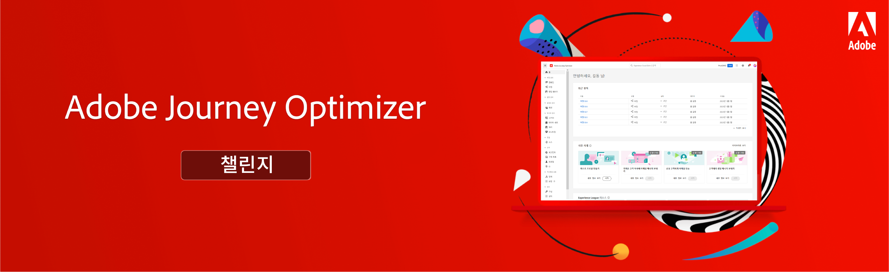

# Journey Optimizer 과제 - 소개 및 사전 

과제는 시나리오 및 학습 내용을 실행하는 데 필요한 요구 사항을 제공합니다. 과제는 기술 수준을 평가하고 지식 격차를 파악하는 데 도움이 됩니다.

이 섹션의 각 과제에서는 구현한 고유의 사용 사례를 해결합니다. 타겟 대상(페르소나) 및 필요한 기술은 각 과제의 시작 부분에 나열되어 있습니다.

## 전제 조건

다음 전제 조건이 충족되는지 확인합니다.

### 시스템 요구 사항

* Journey Optimizer 샌드박스 액세스 - 전용 교육 샌드박스에서 과제를 완료하는 것을 추천합니다.
* AEM Assets Essentials를 학습자의 인스턴스용으로 프로비저닝해야 합니다.
* 트랜잭션 및 마케팅 메시지용 [이메일 채널을 구성해야 합니다](https://experienceleague.adobe.com/docs/journey-optimizer/using/configuration/channel-surfaces.html?lang=ko).

### 액세스 권한

다음 액세스 권한이 필요합니다.

* *여정 관리자* 또는 *여정 최고 관리자*
* 테스트 프로필 및 해당 속성 보기

>[!NOTE]
> 이 연습 과정은 Luma 샘플 데이터를 기반으로 개발되었습니다. 샘플 데이터로 구성된 교육용 샌드박스를 설정하는 것이 좋습니다. 자세한 지침은 [교육용 샌드박스 구성](/help/tutorial-configure-a-training-sandbox/introduction-and-prerequisites.md) 튜토리얼을 참조하세요.

### 필수 작업

* Adobe Journey Optimizer를 처음 사용하는 경우 [여정 관리자 및 최고 관리자를 위한 Journey Optimizer 시작](https://experienceleague.adobe.com/docs/courses/using/journeyoptimizer-u-1-2022-1-1-0.html?lang=ko) 과정을 완료합니다.

## 스토리

Luma는 여러 국가의 상점, 웹 사이트를 통한 온라인 상의 존재감 및 모바일 앱을 보유한 가상의 스포츠 의류 회사입니다. Luma는 Adobe Journey Optimizer을 사용하여 고객에게 연결되고 상황에 맞는 개인화된 경험을 제공합니다.

Luma는 최신 의류 및 장비 컬렉션을 홍보하고 기존 고객에 대한 판매를 촉진하려고 합니다. 귀하는 Journey Optimizer에서 Luma 마케팅 및 유지 캠페인을 구현하기 위해 고용되었습니다.

## 과제

<table>
<tr>
<td>
 

      
      

  </td>
  <td>
   <strong><a href="summer-collection-announcement-challenge.md">여름 컬렉션 발표 만들기 </strong>
 </a>
      

      <em>기존 고객으로 이루어진 대상자에게 여름 컬렉션 공지 이메일을 보내는 여정을 만듭니다. </em>
      

      <b>필요한 기술:</b>
      <li><a href="https://experienceleague.adobe.com/docs/journey-optimizer-learn/tutorials/profiles-segments-subscriptions/create-segments.html?lang=ko"> 세그먼트 만들기</li>
      <li><a href="https://experienceleague.adobe.com/docs/journey-optimizer-learn/tutorials/create-journeys/use-case-read-segment.html?lang=ko">세그먼트 읽기</li>
       <li><a href="https://experienceleague.adobe.com/docs/journey-optimizer-learn/tutorials/email-channel/import-and-author-html-email-content.html?lang=ko">HTML 이메일 콘텐츠 가져오기</li>
  </td>
  </tr>
   <tr>
    <td>
    

    
    

    <td>
    

      <a>
    <strong><a href="loyalty-status-welcome-email-challenge.md">충성도 상태 환영 이메일 만들기 </strong>
    </a>
    

    

    <em>충성 고객이 새로운 티어로 이동하면 축하와 함께 새로운 혜택을 알려주는 이메일을 보냅니다.</em>
    

    <b>필요한 기술:</b>
      <li><a href="https://experienceleague.adobe.com/docs/journey-optimizer-learn/tutorials/profiles-segments-subscriptions/create-segments.html?lang=ko"> 세그먼트 만들기</li>
      <li><a href="https://experienceleague.adobe.com/docs/journey-optimizer-learn/tutorials/create-journeys/use-case-read-segment-qualification.html?lang=ko">세그먼트 자격 조건</li>
      <li><a href="https://experienceleague.adobe.com/docs/journey-optimizer-learn/tutorials/email-channel/import-and-author-html-email-content.html?lang=ko">HTML 이메일 콘텐츠 가져오기 및 작성</li>
  </td>
  </tr>
  <tr>
  <td>
  

    
  </td>
  <td>
      <a href="order-confirmation-challenge.md">
 <strong><a href="order-confirmation-challenge.md">주문 확인 만들기</strong>
 </a>
    

    

    <em>트랜잭션 메시지를 만들고 개인화하는 방법에 대한 지식을 테스트합니다
 </em>
    

    <b>필요한 기술:</b>
      <li><a href="https://experienceleague.adobe.com/docs/journey-optimizer-learn/tutorials/email-channel/create-content-with-the-email-designer.html?lang=ko"> 메시지 편집기로 이메일 콘텐츠 만들기</li>
      <li><a href="https://experienceleague.adobe.com/docs/journey-optimizer-learn/tutorials/personalize-content/use-contextual-event-information-for-personalization.html?lang=ko">개인화에 컨텍스트 기반 이벤트 정보 사용</li>
      <li><a href="https://experienceleague.adobe.com/docs/journey-optimizer-learn/tutorials/personalize-content/use-helper-functions-for-personalization.html?lang=ko">개인화에 도우미 기능 사용</li>
  </td>
</table>
