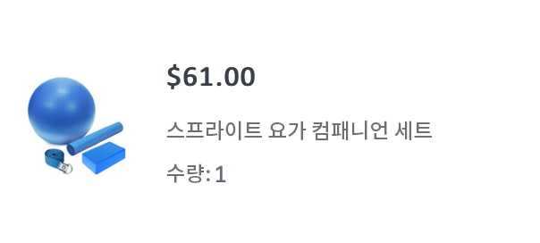
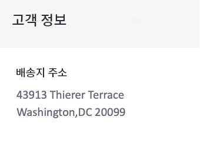

# 주문 확인 트랜잭션 이메일 만들기


| 과제 | 주문 확인 트랜잭션 이메일 만들기 |
|---|---|
| 담당자 | 여정 관리자 |
| 필요한 기술 | <ul><li>[메시지 편집기로 이메일 콘텐츠 만들기](https://experienceleague.adobe.com/docs/journey-optimizer-learn/tutorials/create-messages/create-email-content-with-the-message-editor.html?lang=en)</li> <li>[개인화에 컨텍스트 기반 이벤트 정보 사용](https://experienceleague.adobe.com/docs/journey-optimizer-learn/tutorials/personalize-content/use-contextual-event-information-for-personalization.html?lang=en)</li><li>[개인화에 도우미 기능 사용](https://experienceleague.adobe.com/docs/journey-optimizer-learn/tutorials/personalize-content/use-helper-functions-for-personalization.html?lang=en)</li></ul> |
| 다운로드할 자산 | [주문 확인 자산](/help/challenges/assets/email-assets/order-confirmation-assets.zip) |

## 더 스토리

Luma는 고객이 주문을 한 후 주문 확인 이메일을 제공하여 온라인 스토어를 시작하여 양호한 고객 경험을 확보하려고 합니다.

트랜잭션 주문 확인 메시지를 만들고 개인화합니다.

## 필요한 거 다 있어요?

## 과제

Luma 고객이 온라인 주문을 완료할 때 트리거되는 주문 확인 이메일을 만듭니다.

### 주문 확인 이메일을 만듭니다

&quot;(사용자의 이름)_Luma - 주문 확인&quot;이라는 새 이메일 메시지를 만듭니다. 제목란은 수신자의 이름으로 개인화되어야 하며 &quot;구매에 대한 감사&quot; 구문을 포함해야 합니다

Luma 브랜드 지침에 따라 이메일을 다음과 같이 구조화해야 합니다.

<table>
<tr>
<td>
  <div>
     <strong> 헤더 섹션</strong>
      </div>
  </td>
  <td>
    <strong>Luma 로고</strong>
      <p>
     <li>luma_logo.png</li>
    <li>크기 35%, 가운데 흰색 배경 </li>
    <li>luma 웹 사이트에 대한 링크가 있어야 합니다. https://publish1034.adobedemo.com/content/luma/us/en.html</li>
    <p>
    팁: assets 폴더에서 메시지 이미지라고 하는 모든 이미지를 찾을 수 있습니다. <p>
    </td>
  </tr>
  <tr>
  <td>
  <div>
    <strong>주문 확인 섹션
    </strong>
  </td>
  <td>
    <strong>이미지</strong><p>
    <li>luma-transactional-order-confirmation-2.jpg </li>
    <li>여백: 위쪽, 아래쪽(10)<div>
    <p>
    <strong>텍스트</strong><p>
    <em>구매해 주셔서 감사합니다!</em><p>
    <li>정렬: 왼쪽  </li>
   <li>텍스트 색상: rgb(101, 106, 119); 글꼴 크기:14px</li>
    <li>패딩: 왼쪽(95), 오른쪽(95)</li><div>
    <p>
     <em>주문하셨습니다.
    <p>패키지가 전송되면 주문을 추적할 수 있도록 추적 번호가 포함된 이메일을 보냅니다.</p></em>
    </strong><p>
    <li>정렬: 왼쪽  </li>
    <li>텍스트 색상: rgb(101, 106, 119); 글꼴 크기:14px </li>
    <li>패딩: 왼쪽(95), 오른쪽(95)</li><div>
    </a>
    <p>
    <strong>버튼:</strong>
   <p><em>주문 보기</em></p>
      <li>배경색: rgb(25, 121, 195)</li>
      <li>텍스트 색상: 흰색</li>
      <li>테두리 없음</li>
      <li>높이: 40</li>
      <li>원하는 웹 사이트에 링크 추가 </li>
      <li>왼쪽으로 위의 텍스트에 맞춥니다(팁: 컨테이너 여백 사용)</li>
  </td>
 <tr>
<td>
  <div>
     <strong>주문 세부 사항 섹션</strong>
      </div>
      <p>팁:
      <li>상황에 맞는 이벤트 정보입니다. 메시지를 여정에 추가한 후에만 컨텍스트에 을 추가할 수 있습니다(2단계 참조). 여정에 추가하고 컨텍스트 기반 이벤트 정보로 수정하기 전에 이메일을 게시하지 마십시오!</li>
      <li>도우미 함수를 사용합니다. 각</li>
      <li>HTML 편집기 형식을 컨텍스트 데이터에 사용합니다.DIV 태그를 사용하여 정보를 컨테이너에 넣습니다.</li>
  </td>
  <td>
    <strong>Header</strong>
    <p>
    <em>주문 {구매 발주 번호}</em>
    </p>
    <strong>순서가 지정된 제품 목록:
  </strong>
  <p>각 항목의 형식은 다음과 같이 지정해야 합니다.
    
</p>
<strong>제품 이미지:</strong>
<li>클래스: 장바구니 항목 의자
<li>스타일: 테두리 상자: min-height:40px</li>
<li>위쪽 및 아래쪽 패딩:20px</li>
<li>padding-left:80px</li>
<li>테두리 반경:0px</li>
<li>을 컨테이너의 배경 이미지로 사용합니다</li>
<li>배경 위치: 0% 50%</li>
<li>배경 크기: 60px</li>
<li>background-repeat: 반복되지 않음</li>
<p>
<strong>가격:</strong>
<li>형식 = H5</li>
<li>style = box-sizing:border-box</li>
<li>margin-bottom:5px</li>
<li>margin-top:0px;</li>
<p>
<strong>이름 및 수량:</strong>
<li>class=text-small</li>
<li>style=box 크기 조정: 테두리 상자</li>
<li>padding-top: 5px</li>
<li>색상: rgb(101, 106, 119)</li>
<li>글꼴 크기:14px</li>
<p>
</td>
  </tr>
</table>

### 여정 만들기

1. 여정을 &quot;your name _Luma-Order Confirmation&quot;으로 호출합니다.
1. 이벤트 사용: LumaOnlinePurchase
1. 작업: 1단계에서 만든 메시지를 추가합니다
1. 메시지로 돌아가서 컨텍스트 특성을 추가합니다
1. 이메일 게시

>[!TIP]
>
>여정 문제를 해결할 수 있도록 하기 위해 가장 좋은 방법은 시간 제한이나 오류가 발생할 경우 모든 메시지 작업에 대체 경로를 추가하는 것입니다.

+++성공 기준

테스트 모드에서 만든 여정을 트리거하고 직접 이메일을 전송합니다.

1. 눈 기호를 클릭하여 숨겨진 값을 표시합니다.
   1. 전자 메일 매개 변수에서 T 기호를 클릭합니다(매개 변수 무시 활성화).
      
   2. Address 필드를 클릭합니다.
   3. 다음 화면에서는 이메일 주소를 괄호로 묶습니다. *yourname@yourdomain* 표현식 편집기에서 확인을 클릭합니다.
2. 여정을 테스트 모드로 전환합니다.
3. 다음 매개 변수로 이벤트를 트리거합니다.
   * 프로필 식별자를 다음으로 설정: Jenna_Palmer9530@emailsim.io
   * 이벤트 유형: commerce.purchases
   * 이름: 스프라이트 요가 컴패니언 키트
   * 수량: 1
   * 가격 합계: 61
   * 주문 번호: 6253728
   * SKU: 24-WG080
   * productImageURL: <https://publish1034.adobedemo.com/content/dam/luma/en/products/gear/fitness-equipment/luma-yoga-kit-2.jpg>

지정된 제품과 함께 개인화된 구매 확인 이메일을 받게 됩니다.

* 제목란은 테스트 프로필의 이름으로 시작해야 합니다. 제나
* 주문 세부 사항 섹션은 테스트 중에 입력한 주문 세부 사항으로 채워야 합니다
* 고객 정보는 테스트 프로필의 구/군/시 및 우편 번호가 있어야 합니다.

   43913 타일러 테라스, 워싱턴 DC 20099

+++

+++작업 확인

**제목 줄:**

{{ profile.person.name.firstName }}감사합니다!

**헤더 및 확인 섹션:**


**주문 세부 사항 섹션:**


다음은 코드가 있어야 하는 모습입니다.

Header:

```javascript
Order: {{context.journey.events.1627840522.commerce.order.purchaseOrderNumber}}
```

제품 목록:

도우미 함수 &quot;each&quot;를 사용하여 제품 목록을 만듭니다. 다음은 코드가 있어야 하는 모습입니다.

```javascript
{{#each context.journey.events.1911672547.productListItems as|product|}}
<div class="cart-item-chair" style="box-sizing:border-box;min-height:40px;padding-top:20px;padding-bottom:20px;padding-left:80px;border-radius:0px;background-image:url({{product._wwfovlab065.productImageURL}});background-position:0% 50%;background-size:60px;background-repeat:no-repeat;">
<h5 style="box-sizing:border-box;margin-bottom:5px;font-size:16px;line-height:20px;margin-top:0px;">${{product.priceTotal}}.00</h5>
<div class="text-small" style="box-sizing:border-box;padding-top:5px;color:rgb(101, 106, 119);font-size:14px;">{{product.name}}</div><div class="text-small" style="box-sizing:border-box;padding-top:5px;color:rgb(101, 106, 119);font-size:14px;">Quantity: {{product.quantity}}</div></div><div class="divider-small" style="box-sizing:border-box;height:1px;margin-top:10px;margin-bottom:10px;background-color:rgb(209, 213, 223);"> </div>
{{/each}}

Total: ${{context.journey.events.1627840522.commerce.order.priceTotal}} 
```

**고객 정보 섹션**



개인화는 다음과 같습니다.

```javascript
{{profile.homeAddress.street1}}
{{profile.homeAddress.city}},{{profile.homeAddress.state}} {{profile.homeAddress.postalCode}}
```

**바닥글:**


**여정**


+++
