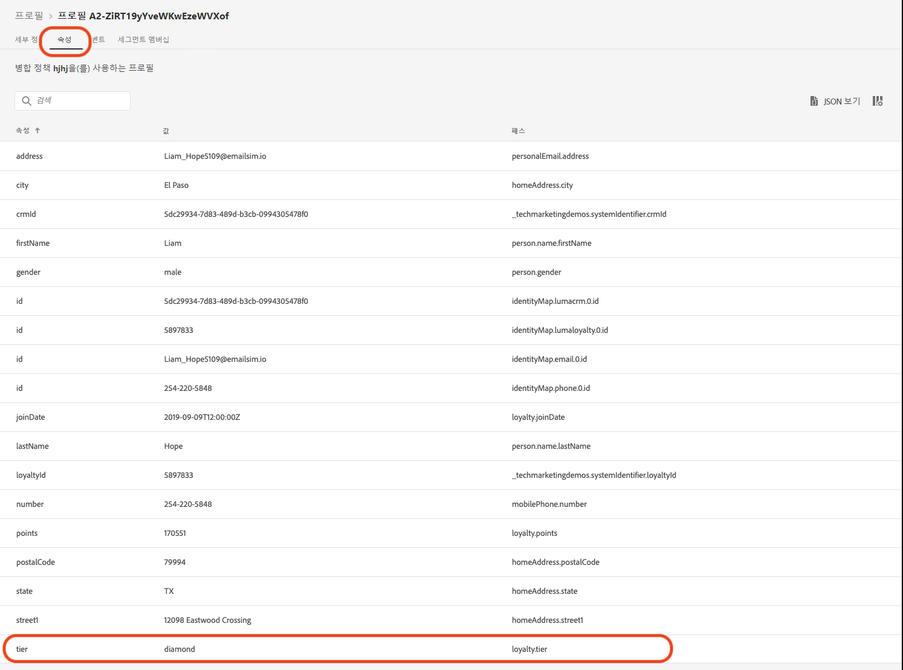
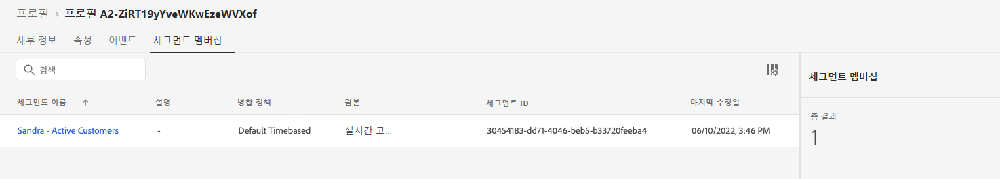

# 여름 컬렉션 발표 만들기 - 과제


| 과제 | 여름 컬렉션 발표 만들기 |
|---|---|
| 담당자 | 여정 관리자 |
| 필요한 기술 | <ul><li>[세그먼트 만들기](https://experienceleague.adobe.com/docs/journey-optimizer-learn/tutorials/profiles-segments-subscriptions/create-segments.html?lang=en)</li><li> [HTML 이메일 콘텐츠 가져오기 및 작성](https://experienceleague.adobe.com/docs/journey-optimizer-learn/tutorials/create-messages/create-emails/import-and-author-html-email-content.html?lang=en)</li><li>[사용 사례 - 세그먼트 읽기](https://experienceleague.adobe.com/docs/journey-optimizer-learn/tutorials/create-journeys/use-case-read-segment.html?lang=en)</li> |
| 다운로드할 자산 | [계절별 컬렉션 전자 메일 파일](/help/challenges/assets/email-assets/emails-seasonal-collection-announcement.zip) |

>[!NOTE]
> 이 연습은 Luma 샘플 데이터를 기반으로 개발되었습니다. 샘플 데이터로 구성된 교육 샌드박스를 설정하는 것이 좋습니다. 자습서를 방문하십시오 [Adobe Experience Platform으로 샘플 데이터 가져오기](https://experienceleague.adobe.com/docs/platform-learn/tutorials/import-sample-data.html?lang=ko-KR) 자세한 지침

## 더 스토리

가상 운동복 회사인 루마는 최신 의류와 기어 컬렉션을 홍보하고 기존 고객을 위한 판매를 유도하려고 합니다. Luma는 새로운 여름 컬렉션을 시작하고 있으며, 특별히 다양한 고객 세그먼트를 타겟팅하고 싶습니다.

## 과제

Luma 마케팅 팀은 Journey Optimizer에서 여름 컬렉션 마케팅 캠페인을 구현하도록 요청합니다.

Journey Optimizer에서 여정을 만드는 것이 당면 과제입니다. 특히 필요한 세그먼트를 만들고, 4개의 메시지를 만들고, 여정을 빌드해야 합니다.

>[!NOTE]
> 공유 교육 샌드박스에서 작업 중인 경우, 만든 요소의 이름에 접두사로 이름이나 이니셜을 추가하는 것이 가장 좋습니다.

### 1단계: 세그먼트 정의 - 활성 고객

>[!BEGINTABS]

>[!TAB 작업]

Journey Optimizer에서 **사용자 이름 - 활성 고객**.

* 세그먼트는 활성 Luma 고객만 포함해야 합니다.
* 활성 고객은 Luma의 충성도 프로그램(은, 금, 백금 또는 다이아몬드)에 계층이 있는 고객으로 정의됩니다.


>[!TAB 성공 기준]

세그먼트 빌더에서 예상 자격 있는 프로필 수를 볼 수 있습니다. Luma 샘플 데이터를 사용하는 교육 샌드박스에서 작업 중인 경우, [!UICONTROL 검증된 프로필] 은 500개의 프로필 중 약 292개여야 합니다.

**자격 있는 프로필이 세그먼트에 추가되었습니다.**

세그먼트의 세부 사항 보기에 나열된 프로필 중 하나로 이동하여 세그먼트 자격에 추가된 프로필을 확인할 수 있습니다.

프로필 페이지에서 [!UICONTROL 속성] 탭을 사용하여 자격이 있는지 확인합니다. 계층은 은, 금, 백금 또는 다이아몬드여야 합니다.



또한 [!UICONTROL 세그먼트 멤버십] 탭: 세그먼트가 나열되어야 합니다.

>[!NOTE]
>기존 프로필을 다시 채워야 하므로 기존 프로필에 대해 세그먼트 멤버십이 표시되는 데 최대 24시간이 걸릴 수 있습니다.



>[!TAB 작업 내용 확인]

세그먼트 필드: [!UICONTROL 속성] > [!UICONTROL XDM 개별 프로필] > [!UICONTROL 충성도] > [!UICONTROL 계층]

세그먼트는 다음과 같이 표시되어야 합니다.


세그먼트 편집 화면의 이벤트 아래에서 오른쪽 아래 모서리에 있는 코드를 확인합니다.

코드는 다음과 같습니다.

```javascript
loyalty.tier.equals("diamond", false) or loyalty.tier.equals("gold", false) or loyalty.tier.equals("platinum", false) or loyalty.tier.equals("silver", false)
```

>[!ENDTABS]


### 2단계: 여정 만들기 - 여름 컬렉션 공지

>[!BEGINTABS]

>[!TAB 작업]

새로운 Luma 여름 컬렉션을 홍보하는 기존 고객의 이메일 세그먼트에 여름 컬렉션 알림을 보냅니다.&#39;

한 에이전시가 전자 메일 디자인이 포함된 4개의 HTML 파일을 제공했습니다. [계절별 컬렉션 이메일 파일을 다운로드합니다](/help/challenges/assets/email-assets/emails-seasonal-collection-announcement.zip)

라는 여정 만들기 `(your name) - Summer collection announcement` 다음 지침을 기반으로 합니다.

1. Luma - New Seasonal Collection Announcement 이메일을 Luma-Active Customers 세그먼트로 보내 대상자의 10%를 컨트롤 그룹으로 사용
   * 메시지 제목 `(your name)_Luma New Seasonal Collection Announcement`.
   * 제목 줄 `(recipient's first name), the new Luma collection is here!`.
   * 제공된 HTML 파일 사용 *SeasonalCollectionEmail.html* 이메일 본문에 사용됩니다.
2. 이틀 동안 기다렸다가 더 많은 타깃팅된 컨텐츠가 있는 후속 이메일 메시지를 보냅니다.
   * 남성 고객은 **Luma Men&#39;s Collection 이메일**
      * 메시지 제목: **(사용자 이름)_Luma Men&#39;s Collection**
      * 제목 줄: **(수신자의 이름), 남성용 새로운 운동 장비를 살펴보십시오!**
      * 이메일 본문: *MensCollectionEmail.html* 이메일 본문에 사용됩니다.
   * 여성 고객은 **Luma Women&#39;s Collection 이메일**
      * 메시지 제목: **(사용자 이름)_Luma 여성 컬렉션**
      * 제목 줄: **(수신자 이름), Luma&#39;s Women Collection을 살펴보십시오!**
      * 이메일 본문: *WomensCollectionEmail.html*
   * 다른 고객은 **Luma - 컬렉션 이메일 20% 할인**
      * 메시지 제목: **(사용자 이름)_Luma - 20% 오프 컬렉션**
      * 제목 줄:**(수신자 이름) 20% 할인 판매**
      * 이메일 본문: *20FfCollectionEmail.html*
3. 위에 타겟팅된 이메일을 보낸 후 이메일이 열릴 때까지 2일 기다립니다
4. 타겟팅된 이메일이 2일 이내에 열리지 않으면 다음 주소로 **Luma - 20 %off 컬렉션 이메일** 최종 재타겟팅 시도로서


>[!TAB 성공 기준]

#### 이메일 미리 보기

**이메일 메시지 #1- 새로운 시즌 컬렉션 발표**

ID 네임스페이스를 사용하여 이메일을 미리 봅니다. *이메일* 및 ID 값: *Jenna_Palmer9530@emailsim.io*

* 제목 줄에는 다음 내용이 포함되어야 합니다. 제나, 새로운 루마 컬렉션이 여기 있어!
* 이메일 본문은 미리 보기에서 본 이메일과 일치해야 합니다. [새로운 시즌 컬렉션 발표](/help/challenges/assets/email-assets/SeasonalCollectionEmail.html)


**이메일 메시지 #2 - Luma Men&#39;s Collection**

자신에게 증명 보내기

* 이메일 주소를 입력합니다
* 테스트 프로필을 선택합니다. Chris_Scott1244@emailsim.io

이메일을 받아야 합니다. 제목 줄에 &quot;Chris, explore Men&#39;s New athletic gear!&quot; 이라고 적혀 있어야 합니다. 및 이메일 본문은 미리 보기에서 본 내용과 일치해야 합니다. [Luma Men&#39;s Collection](/help/challenges/assets/email-assets/MensCollectionEmail.html)

**이메일 메시지 #3 - Luma Women&#39;s Collection**

ID 네임스페이스를 사용하여 이메일을 미리 봅니다. *이메일* 및 ID 값: *Jenna_Palmer9530@emailsim.io*

* 제목 줄에는 다음 내용이 포함되어야 합니다. *제나, 루마의 여성 콜렉션을 살펴봐!*
* 이메일 본문은 미리 보기에서 본 이메일과 일치해야 합니다. [루마 여자 컬렉션](/help/challenges/assets/email-assets/WomensCollectionEmail.html)


**이메일 메시지 #4 - Luma 20% 오프 컬렉션**

ID 네임스페이스를 사용하여 이메일을 미리 봅니다. *이메일* 및 ID 값: *Benny_Steer4909@emailsim.io*

* 제목 줄에는 다음 내용이 포함되어야 합니다. *베니, 20% 할인 판매!*
* 이메일 본문은 미리 보기에서 본 이메일과 일치해야 합니다. [Luma 20% 오프 컬렉션](/help/challenges/assets/email-assets/20OOffCollectionEmail.html)

**이메일 게시 잊지 마십시오!**

#### 여정 테스트

>[!IMPORTANT]
>
>여정을 테스트 모드로 설정하기 전에:
>
>1. 세그먼트 읽기 활동 에 네임스페이스가 이메일로 설정되어 있는지 확인합니다.
>1. 각 이메일에 대해 이메일 주소로 전송하도록 이메일의 기본 이메일 매개 변수를 무시합니다.
>1. 눈 기호를 클릭하여 숨겨진 값을 표시합니다.
>1. 전자 메일 매개 변수에서 T 기호를 클릭합니다(매개 변수 무시 활성화).

   >
   >      
> 
>1. Address 필드를 클릭합니다.
>1. 다음 화면에서는 이메일 주소를 괄호로 묶습니다. *yourname@yourdomain* 표현식 편집기에서 확인을 클릭합니다.

>


여정을 테스트하고 전자 메일을 자신의 계정에 전송하도록 합니다.

1. 여정을 테스트 모드로 전환합니다.
2. 한 번에 하나의 프로필 선택
3. 대기 시간: 타이머를 120초로 설정합니다(필드에 입력).
4. 프로필 시작 트리거
5. 다음 이메일 주소 중 하나를 프로필 식별자로 사용하여 각 분기를 테스트할 수 있습니다.
   * 여성: 제나 팔머: Jenna_Palmer9530@emailsim.io
   * 남성: 크리스 스캇: Chris_Scott1244@emailsim.io
   * 성별을 지정하지 않았습니다. 베니 스트리: Benny_Steer4909@emailsim.io

6. 프로필 입력을 트리거하면 첫 번째 이메일을 수신해야 하며, 헤더는 선택한 프로필에 따라 개인화되어야 합니다.
7. 여정은 각 분기로 계속 진행되어야 하며 관련 이메일을 수신해야 합니다(예를 들어, 젠나를 선택한 경우, &quot;Luma 여성 컬렉션&quot; 이메일을 수신해야 함).
8. 두 번째 이메일을 엽니다. 그러면 여정이 종료됩니다
9. 4단계를 반복할 수 있습니다. - 7. 모든 분기가 올바르게 작동하는지 확인하려면 세 프로필 모두에 대해 를 사용하십시오.
10. 시간 초과를 테스트하려면 대기 시간을 30초로 설정하고 항목을 다시 트리거합니다.
11. 받은 전자 메일을 열지 않습니다(전자 메일(!)는 미리 보지 마십시오. 대기시간을 줄이게

다음 이메일을 수신해야 합니다.

* Luma - 새로운 시즌 컬렉션 발표
* 사용한 테스트 프로필에 따라 다음 이메일 중 하나를 수신해야 합니다.
   * 제나: 루마 여자 컬렉션
   * 크리스: Luma Men&#39;s Collection
   * 베니: Luma - 20% 해제 컬렉션
* 두 번째 이메일을 열지 않은 경우: Luma - 20% 해제 컬렉션

>[!TAB 작업 확인]

여정 모습은 다음과 같습니다.


**조건 - 컨트롤 그룹:**


**조건 - 성별:**\


>[!ENDTABS]
