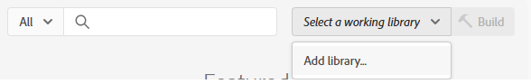

# Adobe Experience Platform 태그 만들기

Adobe Experience Platform 태그(이전의 Adobe Launch)를 사용하면 사이트 코드를 변경하지 않고도 웹 사이트에서 marketing 및 analytics 기술을 관리 및 배포*할 수 있습니다.

이 [비디오에서는 Adobe Experience Tags를 만드는 과정을 설명합니다](https://experienceleague.adobe.com/en/playlists/experience-platform-get-started-with-tags)

- 데이터 수집에 로그인
- _&#x200B;**태그 -> 새 속성**&#x200B;_&#x200B;을 클릭합니다.

- _&#x200B;**기상 시 개인화**&#x200B;_&#x200B;라는 Adobe Experience Platform 태그를 만듭니다.

- 태그에 다음 확장 추가
  
- 아래 표시된 대로 &quot;ECID&quot;라는 데이터 요소를 추가합니다. 이 데이터 요소는 나중에 보고에서 사용됩니다
  

- 이전 단계에서 만든 **날씨 관련 데이터스트림**&#x200B;과 올바른 환경을 사용하도록 Adobe Experience Platform Web SDK을 구성해야 합니다.
  


## AEP 태그 작성 및 배포


아래 스크린샷에 표시된 대로 새 라이브러리를 만들고 수정된 모든 리소스를 라이브러리에 추가합니다.

**라이브러리 추가**



**라이브러리 만들기**

라이브러리 만들기 화면에서 라이브러리 이름과 환경을 지정합니다.

변경된 모든 리소스를 이 라이브러리에 추가


그런 다음 Save and Build to Development 단추를 클릭하여 라이브러리를 빌드합니다.

## HTML 페이지에 AEP 태그 포함

AEP Tags 속성을 게시하면 Adobe에서 HTML ``` <head>``` 내부 또는 ``` <body>``` 태그의 맨 아래에 배치해야 하는 스크립트 태그를 제공합니다.

- Tags(personalization-on-weather) 속성으로 이동합니다.

- 환경 을 클릭하고 원하는 환경의 설치 아이콘(예: 개발, 스테이징, 프로덕션)을 클릭합니다.

- 포함된 코드를 기록합니다. 이 자습서의 이후 단계에서 필요합니다.
