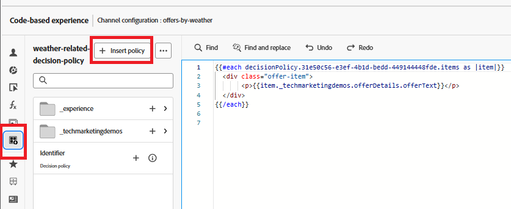

# 캠페인 만들기

웹 페이지의 사용자에게 개인화된 오퍼를 전달하기 위해 Adobe Journey Optimizer에 캠페인이 만들어지고 올바른 채널인 코드 기반 경험 채널로 구성되었습니다. 이 구성은 웹 사이트와 상호 작용하는 사용자에게 실시간 의사 결정을 통해 오퍼가 전달되도록 합니다.

이 캠페인 내에서 오퍼 선택 방법을 제어하는 의사 결정 정책이 정의되었습니다. 의사 결정 정책에는 다음과 같은 선택 전략이 포함됩니다.

- 오퍼 항목의 컬렉션(예: 날씨 관련 태그 기반),
- 사용자에게 적용되는 오퍼를 결정하는 자격 규칙 및
- 가장 관련성이 높은 오퍼의 우선 순위를 지정하기 위해 적격 오퍼에 점수를 할당하는 순위 공식입니다.

사용자가 웹 사이트를 방문하면 시스템이 자신의 위치를 감지하고 날씨 API를 사용하여 현재 온도를 가져옵니다. 그런 다음 이 온도 데이터는 웹 SDK(Alloy)를 통해 Adobe Experience Platform으로 전송됩니다. Adobe Journey Optimizer은 이러한 실시간 컨텍스트 데이터를 기반으로, 덥거나, 온화하거나, 추위와 같은 특정 날씨 조건에 대해 태그가 지정된 사전 정의된 오퍼를 평가합니다. 선택 전략 및 순위 공식을 사용하는 가장 관련성이 높은 오퍼는 Adobe의 의사 결정 엔진을 사용하여 웹 페이지에 자동으로 렌더링되므로 사용자가 해당 지역의 현재 날씨와 정렬된 개인화된 콘텐츠를 받을 수 있습니다.

## AJO에서 캠페인을 만드는 높은 수준의 단계

- 채널 구성 만들기
   - 오퍼가 표시되는 위치와 방법을 정의합니다(예: 코드 기반 경험이 있는 웹 페이지).
   - 여정 최적화 프로그램에 로그인
   - _&#x200B;**관리 ->채널->채널 구성 만들기**&#x200B;_(으)로 이동합니다.
   - **이름**: `offers-by-weather`\
     개인화된 웹 오퍼 게재를 위한 이 구성을 식별합니다.
- **채널**:
  `Code-based experience`\
  오퍼는 DOM에 직접 삽입되지 않습니다. 대신 AJO은 사용자 지정 JavaScript을 사용하여 구문 분석된 원시 HTML을 반환합니다.
- **플랫폼**: `Web`\
  특히 웹 브라우저에 맞게 타깃팅됩니다. 활성화된 모바일 채널이 없습니다.

- **페이지 URL**: `https://gbedekar489.github.io/weather/weather-offers.html`\
  채널은 개발 중에 사용되는 특정 테스트 페이지에 대해 구성됩니다.
- **페이지의 위치**: `offerContainer`\
  반환된 오퍼는 프론트엔드 논리를 사용하여 동적으로 구문 분석되고 이 컨테이너로 렌더링됩니다.

- **콘텐츠 형식**: `HTML`\
  오퍼는 원시 HTML 조각으로 제공되므로 스타일 지정, 필터링 및 표시 방법을 완벽하게 제어할 수 있습니다.

- **새 캠페인 시작**
   - 캠페인 섹션으로 이동하여 새 예약된 마케팅 캠페인을 만듭니다. 캠페인 이름을 적절하게 지정합니다.
   - **작업 추가**
      - 코드 기반 경험 작업을 추가하고 작업을 이전에 만든 채널 구성에 연결합니다.

   - **대상자**
      - 모든 방문자 (기본값).
      - ID 유형: ECID (Experience Cloud ID)
이 설정은 사용자를 인식하기 위한 기본 ID로 ECID를 사용합니다.

- **의사 결정 정책 만들기**
   - 작업이 오퍼 선택 방법과 표시하기 위해 반환되는 오퍼 수를 정의하는 **의사 결정 정책**&#x200B;에 연결되어 있습니다. 이 정책은 자습서에서 이전에 만든 **선택 전략**&#x200B;을 사용합니다.
   - 의사 결정 정책을 삽입하려면 작업 섹션에서 **_콘텐츠 편집_**&#x200B;을 클릭한 다음 **_코드 편집_**&#x200B;을 클릭하여 개인화 편집기를 엽니다.
   - 왼쪽의 _&#x200B;**결정 정책**&#x200B;_ 아이콘을 선택하고 **결정 정책 추가** 단추를 클릭하여 **결정 정책 만들기** 화면을 엽니다. 결정 정책에 의미 있는 이름을 제공하고 결정 정책이 반환해야 하는 항목의 수를 선택합니다. 기본값은 1입니다.
   - **_다음_**&#x200B;을 클릭하고 이전 단계에서 만든 선택 전략을 결정 정책에 추가하고 **다음**&#x200B;을 클릭하여 결정 정책을 만드는 프로세스를 완료합니다. 결정 정책과 연결된 대체 오퍼가 없습니다.

- **결정 정책 삽입**
  

  _&#x200B;**정책 삽입**&#x200B;_ 단추를 클릭하여 새로 만든 결정 정책을 삽입합니다. 오른쪽에 개인화 편집기에 for 루프가 삽입됩니다.
2행의 각 루프 사이에 커서를 놓고 `tenant name`을(를) 드릴다운하여 오퍼로 이동하여 offerText를 삽입합니다. 스크린샷과 같이 Div에서 오퍼를 클래스 오퍼 항목과 함께 래핑합니다.

- **캠페인 게시**\
  캠페인을 활성화하여 개인화된 오퍼를 실시간으로 제공할 수 있습니다.
