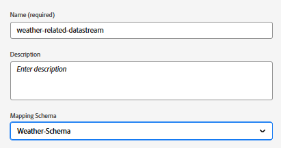

# AEP에서 XDM 스키마, 데이터 세트 및 데이터 스트림 설정

## XDM 스키마 만들기

웹 페이지에서 Adobe Experience Platform 웹 SDK(Alloy.js)를 사용하려면 AEP 태그를 XDM 이벤트 스키마에 매핑된 데이터 스트림에 연결해야 합니다. 웹 SDK(alloy.sendEvent)는 XDM ExperienceEvent 클래스를 기반으로 하는 XDM 스키마를 준수해야 하는 데이터를 경험 이벤트로 AEP에 보냅니다.

XDM 스키마를 만들려면

- Adobe Experience Platform에 로그인
- _&#x200B;**데이터 관리 -> 스키마 -> 스키마 만들기**&#x200B;_(으)로 이동

- **_날씨 스키마_**&#x200B;라는 XDM 이벤트 기반 스키마를 만듭니다. 스키마 만들기에 익숙하지 않은 경우 이 [설명서](https://experienceleague.adobe.com/en/docs/experience-platform/xdm/tutorials/create-schema-ui)를 따르십시오.

- 스키마에 적절한 데이터 유형이 있는 다음 필드가 있는지 확인합니다.

- 

- 필드 그룹 _&#x200B;**웹 세부 정보**&#x200B;_&#x200B;를 스키마에 추가합니다. 이 필드 그룹은 보고용으로 필수입니다.

## 스키마를 기반으로 데이터 세트 만들기

Adobe Experience Platform(AEP)의 **데이터 집합**&#x200B;은(는) 정의된 XDM 스키마를 기반으로 데이터를 수집, 저장 및 활성화하는 데 사용되는 구조화된 저장소 컨테이너입니다.

- _&#x200B;**데이터 관리 -> 데이터 세트 -> 데이터 세트 만들기**&#x200B;_(으)로 이동
- 이전 단계에서 만든 XDM 스키마(**_Weather-Schema_**)를 기반으로 _&#x200B;**Weather-schema-dataset**&#x200B;_&#x200B;이라는 데이터 집합을 만듭니다.

## 데이터 스트림 만들기

Adobe Experience Platform의 데이터 스트림은 웹 사이트 또는 앱을 Adobe 서비스에 연결하는 보안 파이프라인(또는 고속도로)과 유사하므로 데이터가 이동하고 개인화된 콘텐츠가 다시 흐를 수 있습니다.

- _&#x200B;**데이터 수집 > 데이터스트림**&#x200B;_(으)로 이동한 다음 새 데이터스트림을 클릭합니다. 데이터스트림의 이름을 **날씨 관련 데이터스트림**&#x200B;으로 지정합니다.

- 아래 스크린샷과 같이 다음 세부 정보를 제공합니다
  
- 저장 을 클릭한 다음 매핑 추가 를 클릭하고 적절한 확인란을 선택하여 Adobe Experience Platform 서비스 및 이벤트 데이터 세트를 추가합니다
  

- 데이터스트림을 저장합니다.

>[!NOTE]
>
>새로 만든 데이터 세트는 등급 수식 또는 Personalization 편집기에서 선택할 수 있기까지 최대 24시간이 걸릴 수 있습니다.
