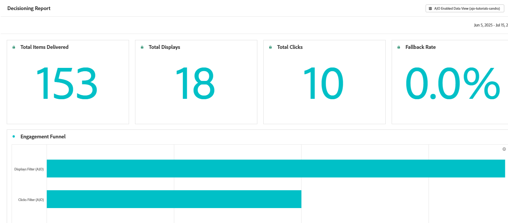

# AJO decisioning을 통해 제공된 Journey Optimizer 오퍼 추적 및 보고

이 사용 사례는 Adobe Journey Optimizer(AJO)를 통해 제공되는 오퍼에 대한 보고 및 성능 분석을 활성화하는 데 중점을 둡니다. 상황별 신호(예: 날씨 또는 위치)를 기반으로 오퍼가 개인화되고 전달되면 노출과 사용자 상호 작용을 모두 추적하여 효과를 평가하는 것이 중요합니다.

Adobe Web SDK을 통해 decisioning.propositionDisplay 및 decisioning.propositionInteract 이벤트를 캡처하고 Adobe Experience Platform(AEP)의 구조화된 XDM 스키마에 매핑하면 오퍼 수준 참여 데이터를 분석할 수 있습니다. 그런 다음 Customer Journey Analytics(CJA)에서 이 데이터를 사용하여 대시보드를 작성하고 클릭스루 비율(CTR)과 같은 주요 지표를 측정하며 다양한 대상 세그먼트 및 컨텍스트 조건에서 오퍼 성능을 비교할 수 있습니다.

목표는 개인화된 오퍼가 얼마나 잘 수행되고 있는지 데이터 기반의 명확한 통찰력을 제공하고 향후 의사 결정 전략을 알리는 것입니다.

## 이 자습서의 사전 요구 사항

시작하기 전에 [실시간 날씨 데이터를 사용하여 오퍼 개인화 자습서를 완료하십시오.](https://experienceleague.adobe.com/ko/docs/journey-optimizer-learn/personalizing-offers-with-real-time-weather-data/introduction) 다음을 포함한 모든 기본 구성 요소를 설정합니다.

- 웹 SDK 통합
- Adobe Journey Optimizer(AJO)의 오퍼 설정
- 날씨 및 온도와 같은 상황별 속성을 사용한 의사 결정
- 웹 페이지에서 실시간 오퍼 렌더링

이 튜토리얼은 해당 구현을 직접 기반으로 하며, 특히 Journey Optimizer에서 보고 및 분석을 위한 오퍼 노출 횟수 및 상호 작용 캡처에 중점을 둡니다.
