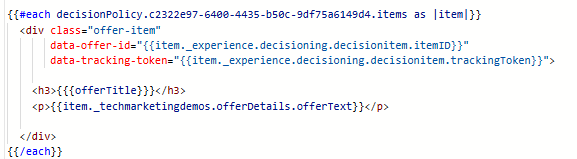

# 오퍼 항목에 추적 토큰 추가

개인화 편집기에서 코드를 수정하려면 다음 단계를 따르십시오.

_&#x200B;**여정 관리 ->캠페인**&#x200B;_(으)로 이동

적절한 캠페인을 열고 _&#x200B;**캠페인 중지**&#x200B;_ 단추를 클릭하여 캠페인을 중지합니다.

중지된 캠페인을 열고 _&#x200B;**캠페인 수정**&#x200B;_ 단추를 클릭합니다.

_&#x200B;**콘텐츠**&#x200B;_ 탭을 클릭한 다음 _&#x200B;**코드 편집**&#x200B;_ 단추를 클릭하여 개인화 편집기를 엽니다.

스크린샷에 표시된 대로 div에 두 개의 새 데이터 속성을 추가합니다

왼쪽 탐색에서 결정 정책 아이콘을 클릭하고 결정 트리를 드릴다운하여 itemID 및 trackingToken을 선택하여 trackingToken 및 ItemID를 추가할 수 있습니다.

이렇게 하면 렌더링된 각 오퍼에 정확한 노출 및 클릭 이벤트 추적에 필수적인 데이터 추적 토큰이 포함됩니다.

변경 사항을 저장하고 캠페인을 활성화합니다.
