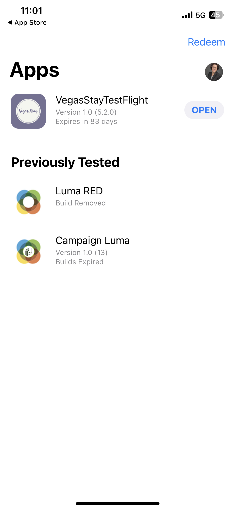

# Summit Lab L731 - 컨닝 페이퍼

이 페이지에는 L731 Summit Lab에서 사용하는 텍스트와 링크가 있습니다. 콘텐츠를 복사하여 Journey Optimizer 메시지에 붙여 넣을 수 있습니다.

## 연습 1.1 - 앱 다운로드 및 설치

QR 코드를 스캔하여 앱을 다운로드합니다.

>[!BEGINTABS]

>[!TAB iOS]

Testflight를 설치하라는 메시지가 표시됩니다(1~4단계). Testflight를 설치한 후 5~8단계에 따라 Vegas Stay 앱을 설치합니다.

<table>
<tr>
</tr>
<tr>
<td>
 

      

      <b>1단계 </b>
      

      
      

  </td>
  <td>
 

      

      <b>2단계 </b>
      

      
      

  </td>
  <td>
 

      

      <b>3단계 </b>
      

      
      

  </td>
  <td>
 

      

      <b>4단계 </b>
      

      
      

  </td>
  </tr>
  <tr>
<td>
 

      

      <b>5단계 </b>
      

      
      

  </td>
  <td>
 

      

      <a>
      <b>6단계 </b>
      

        
      </a>
      

  </td>
  <td>
 

      

      <a>
      <b>7단계 </b>
      

        
      </a>
      

  </td>
  <td>
 

      

      <a>
      <b>8단계 </b>
      

        
      </a>
      

  </td>
  </tr>
</table>

>[!TAB Android]

앱이 Google Play Store에 등록되어 있지 않으므로 경고 메시지가 표시됩니다.

**무시하고 설치**&#x200B;를 클릭합니다

>[!ENDTABS]

## 연습 1: Adobe Journey Optimizer에 로그인하기

[Journey Optimizer에 로그인하려면 여기를 클릭하십시오](https://experience.adobe.com/#/@techmarketingdemos/sname:summit-2023-ajo-lab/journey-optimizer/home)

**로그인 세부 정보:**

* **사용자 이름:** `L731+<your seat number>@summitlab.us` (예: L731+001@summitlab.us)
* **암호:** Adobe2023!

## 연습 2 인앱 캠페인 만들기

| 필드 | 텍스트 | 링크 |
|----|----|----|
| 캠페인 이름 | `<your seat number> Vegas Stay Campaign` |  |
| 적절한 대상 | 지금 예약하기 |  |
| 미디어 URL 옵션 |  | https://i.ibb.co/NstLhjW/Firefly-Poster-with-heading-Adobe-Max-84773.jpg |
| Title | 할인 혜택을 받으세요! |  |
| 본문 | Adobe 맥스가 라스베이거스로 돌아온다. 긍정적인 자극이 될 발제자, 스킬을 키울 수 있는 세션, 새로운 인맥을 만나 볼 준비를 하세요. 지금 스위트룸을 예약하고 10% 할인을 받으세요. |  |
| 버튼 | 10% 할인을 받으세요! | lab://booking?suite=presidential&amp;discount=10 |
| 버튼: 인터랙티브 이벤트 | 인앱 CTA |  |
| 기본 URL 장치에서 미리 보기에 사용됨 |  | **iOS:** lab://  **Android**: https://lab |

## 연습 3: 푸시 알림 만들기

| 필드 | 텍스트 | 링크 |
|----|----|----|
| 캠페인 이름 | `<your seat number> Max Push Campaign` |  |
| 미디어 URL 옵션 |  | https://i.ibb.co/NstLhjW/Firefly-Poster-with-heading-Adobe-Max-84773.jpg |
| Title | 이봐! |  |
| 본문 | Adobe 맥스가 베가스로 돌아온다는 거 알고 있었어? 지금 객실을 예약하고 10% 할인을 받으세요. |  |
