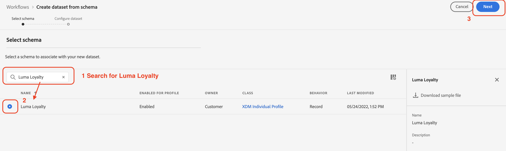

# 수동으로 데이터 수집

이 섹션에서는 데이터 세트를 만들고 샘플 데이터를 수집하는 데 필요한 단계를 안내합니다.

>[!TIP]
>
> 비디오 자습서를 확인하십시오 [데이터 세트 만들기 및 데이터 수집](/help/set-up-data/create-datasets-and-ingest-data.md) 시작하기 전에

5개를 만듭니다 [!UICONTROL 데이터 세트] Luma를 기반으로 [!UICONTROL 스키마] 에서 [이전 섹션](/help/tutorial-configure-a-training-sandbox/manual-data-set-up.md). 데이터 세트가 만들어지면 다운로드하여 수정한 JSON 파일에서 데이터를 수집할 수 있습니다. (자세한 내용은 [소개 및 사전 요구 사항](/help/tutorial-configure-a-training-sandbox/introduction-and-prerequisites.md) 자세한 내용).

## 첫 번째 데이터 세트 만들기

이름이 인 데이터 세트 만들기 *[!DNL Luma Loyalty Data]* 변환 전: [!DNL Luma Loyalty schema]

1. 왼쪽 탐색에서 아래의 [!UICONTROL 데이터 관리], 선택 **[!UICONTROL 데이터 세트]**.

1. 선택 **[!UICONTROL 데이터 집합 만들기]**.

   

1. 다음 페이지에서 [!UICONTROL 스키마에서 데이터 집합 만들기].

   

1. 다음 페이지에서 *[!DNL Luma Loyalty]* 이전에 만든 스키마.

1. *[!DNL Luma Loyalty]*&#x200B;를 선택합니다.

1. **[!UICONTROL 다음]**&#x200B;을 클릭합니다.

   

1. 데이터 세트를 구성합니다.

   * 이름: `Luma Loyalty Data`

1. **[!UICONTROL 마침을 클릭합니다]**.

   

## 샘플 데이터 수집

데이터 세트를 만든 후 데이터를 데이터 세트에 수집할 수 있습니다.

1. 설정 [!DNL Luma Loyalty Data] 페이지, 오른쪽 패널 아래쪽으로 스크롤합니다. [!UICONTROL 데이터 추가] 섹션 및 활성화:

   * **[!UICONTROL 오류 진단]** 및

   * **[!UICONTROL 부분 수집]**

   

1. 을(를) 끌어다 놓습니다 `luma-loyalty.json` 파일을 업로드하여 샘플 데이터를 데이터 세트에 업로드합니다.

1. 페이지를 새로 고침하고 배치 상태를 확인하여 파일이 올바로 수집되었는지 확인합니다.

   375개의 레코드를 수집했어야 합니다. 데이터를 수집하는 데 2분 정도 걸릴 수 있습니다.

>[!TIP]
>
>배치에 실패하면 에서 조직 ID를 대체했는지 확인합니다. `luma-loyalty.json` 파일을 [조직 ID](https://experienceleague.adobe.com/docs/core-services/interface/administration/organizations.html?lang=ko-KR).

## 5개의 추가 작성 [!UICONTROL 데이터 세트]

다음으로, 다음 5개의 추가 항목을 만듭니다 [!UICONTROL 데이터 세트] 및에 데이터를 수집할 수 있습니다. `Luma CRM Data`, `Luma Products Data`, 및 `Luma Test Profiles` 데이터 세트.

| 데이터 집합 이름 | 스키마에서 | 수집할 파일 | 레코드 |
| -----| ------ | -------| ------- |
| `Luma CRM Data` | `Luma CRM` | `luma-crm.json` | 500 |
| `Luma Products Data` | `Luma Products` | `luma-products.json` | 92 |
| `Luma Product Interactions Data` | `Luma Product Interactions` | 없음 | 0 |
| `Luma Product Inventory Events` | `Luma Product Inventory Events` | 없음 | 0 |
| `Luma Test Profiles` | `Luma Test Profiles` | `luma-test-profiles.json` | 3 |

## 다음 단계

필요한 데이터 세트를 모두 만들고 샘플 데이터를 수집했습니다. 마지막 단계는 [이벤트 구성](/help/tutorial-configure-a-training-sandbox/configure-events.md).
