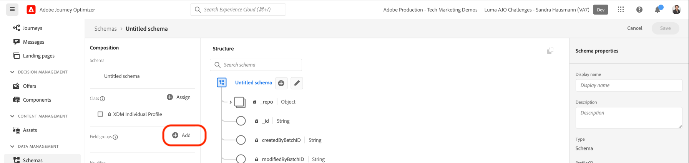
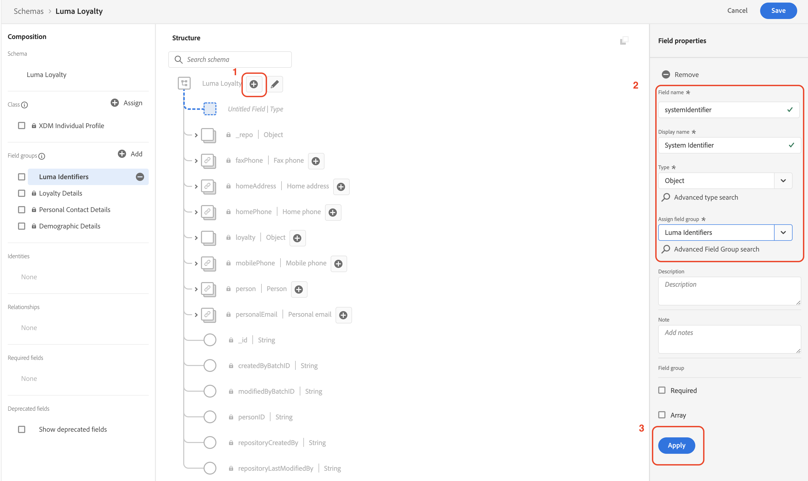

# 수동으로 데이터 설정하기

이 섹션에서는 필요한 신원 네임스페이스를 만들고 [[!UICONTROL 스키마]](https://experienceleague.adobe.com/docs/experience-platform/xdm/schema/composition.html?lang=ko)를 만들어 [!DNL Luma] 샘플 데이터 구조를 정의합니다.

>[!TIP]
>시작하기 전에 [신원 매핑](/help/set-up-data/map-identities.md) 비디오 튜토리얼을 시청하십시오.

## 1단계: 신원 네임스페이스 만들기

이 단계에서는 [!DNL Luma] 사용자 정의 신원 필드 `lumaLoyaltyId`, `lumaCrmId`, `lumaProductSKU`에 대한 신원 네임스페이스를 만듭니다. 동일한 네임스페이스 내에 일치하는 두 값이 있으면 두 개의 데이터 소스가 하나의 아이덴티티 그래프를 구성할 수 있기 때문에 신원 네임스페이스는 실시간 고객 프로필을 작성하는 데 중요한 역할을 합니다.

먼저 다음 단계에 따라 [!DNL Luma Loyalty ID] 스키마에 대한 [!UICONTROL 네임스페이스]를 만듭니다.

1. Journey Optimizer 사용자 인터페이스에서 왼쪽 탐색 인터페이스의 **[!UICONTROL 고객]** > **[!UICONTROL 신원]**&#x200B;으로 이동합니다.

1. **[!UICONTROL 신원 네임스페이스 만들기]**&#x200B;를 선택합니다.

1. 다음 세부 정보를 입력합니다.

   | 표시 이름 | 신원 기호 | 유형 |
   |---|---|---|
   | `Luma Loyalty ID` | `lumaLoyaltyId` | [!UICONTROL 크로스 디바이스 ID] |

1. **[!UICONTROL 만들기]**&#x200B;를 선택합니다.

   

1. 같은 단계에 따라 네임스페이스를 두 개 더 만듭니다.

   | 표시 이름 | 신원 기호 | 유형 |
   |---|---|---|
   | `Luma CRM ID` | `lumaCrmId` | [!UICONTROL 크로스 디바이스 ID] |
   | `Luma Product SKU` | `lumaProductSKU` | [!UICONTROL 비인물 식별자] |

## 2단계: 스키마 만들기

이 단계에서는 [[!UICONTROL 스키마]](https://experienceleague.adobe.com/docs/experience-platform/xdm/schema/composition.html?lang=ko) 여섯 개를 만들어 샘플 데이터의 구조를 정의합니다.

* [[!DNL Luma Loyalty Schema]](#create-luma-loyalty-schema)

* [[!DNL Luma Product Catalog Schema]](#create-luma-product-catalog-schema)

* [[!DNL Luma Product Inventory Events] 스키마](#create-luma-product-inventory-event-schema)

* [[!DNL Luma CRM Schema]](#create-luma-crm-and-luma-product-interactions-schemas)

* [[!DNL Luma Web Events Schema]](#create-luma-crm-and-luma-product-interactions-schemas)

* [[!DNL Luma Offline Purchase Events Schema]](#create-additional-schemas)

* [[!DNL Luma Test Profiles Schema]](#create-additional-schemas)

>[!TIP]
>
>시작하기 전에 [스키마 만들기](/help/set-up-data/create-schema.md) 비디오 튜토리얼을 시청하십시오.

### 만들기 [!DNL Luma Loyalty Schema] {#create-luma-loyalty-schema}

이 섹션에서는 [!DNL Luma Loyalty] 스키마를 만들고 필드 그룹을 구성하는 방법을 설명합니다.

#### 스키마 만들기

1. 왼쪽 탐색 인터페이스에서 **[!UICONTROL 데이터 관리]** > **[!UICONTROL 스키마]**&#x200B;로 이동합니다.

1. 오른쪽 위의 **[!UICONTROL 스키마 만들기]**&#x200B;를 선택합니다.

1. 드롭다운 메뉴에서 **[!UICONTROL XDM 개별 프로필]**&#x200B;을 선택합니다.

   이 옵션을 선택하는 이유는 이 연습에서 개별 고객의 속성(점수, 상태 등)을 모델링하기 때문입니다.

#### 기존 필드 그룹 추가

그런 다음 그룹을 사용하여 스키마에 필드 그룹을 추가하라는 메시지가 표시됩니다. 기존 필드 그룹을 추가하고 필드 그룹을 만들어야 합니다.

1. [!UICONTROL 스키마] 페이지에서 [필드 그룹] 모달이 자동으로 열리지 않으면 **[!UICONTROL 추가]**&#x200B;를 선택합니다.

   

1. **[!UICONTROL 필드 그룹 추가]** 페이지에서 다음 필드 그룹을 활성화합니다.

   * 이름과 생년월일 등 기본 고객 데이터를 위한 **[!UICONTROL 인구 통계 세부 정보]**.

   * 이메일 주소와 전화번호 등 기본 연락처 정보를 위한 **[!UICONTROL 개인 연락처 세부 정보]**.

   * 포인트, 가입 날짜 또는 상태 등 충성도 관련 세부 정보를 위한 **[!UICONTROL 충성도 세부 정보]** 충성도 필드 그룹은 목록의 아래쪽에 있으므로 검색해서 선택하는 것이 제일 간단합니다.

1. **[!UICONTROL 필드 그룹 추가]**&#x200B;를 선택하여 세 필드 그룹을 모두 스키마에 추가합니다.

   

1. 스키마의 최상위 노드를 선택합니다.

1. **[!UICONTROL 표시 이름]**&#x200B;에 `Luma Loyalty Schema`를 입력합니다.

#### [!UICONTROL 필드 그룹] 만들기 {#create-field-group}

Adobe는 스키마 간에 일관성을 유지하기 위해 모든 시스템 식별자를 단일 그룹으로 관리할 것을 추천합니다.

1. [!UICONTROL 필드 그룹] 아래 **[!UICONTROL 컴포지션]** 섹션에서 **[!UICONTROL 추가]**&#x200B;를 선택합니다.

1. **[!UICONTROL 새 필드 그룹 만들기]**&#x200B;를 선택합니다.

1. **[!UICONTROL 표시 이름]**&#x200B;에 `Luma Identity Profile Field Group`을 입력합니다.

1. **[!UICONTROL 설명]**&#x200B;에 `system identifiers for XDM Individual Profile class`를 추가합니다.

1. **[!UICONTROL 필드 그룹 추가]**&#x200B;를 선택합니다.

   

#### 새 [!UICONTROL 필드 그룹]에 필드 추가

비어 있는 새 필드 그룹이 스키마에 추가됩니다. + 버튼을 사용하여 계층의 모든 위치에 새 필드를 추가할 수 있습니다. 이 경우 루트 수준에서 필드를 추가해야 합니다.

1. 스키마 이름 옆의 **[!UICONTROL +]** 버튼을 선택합니다.

   이 단계에서는 사용자 정의 필드와 표준 필드(있는 경우) 간 충돌을 관리하기 위해 **내 테넌트 id** 네임스페이스 아래에 필드를 추가합니다.

1. **[!UICONTROL 필드 속성]** 사이드바에서 새 필드의 세부 정보를 추가합니다.

   * **필드 이름:** `systemIdentifier`

   * **[!UICONTROL 표시 이름]:** `System Identifier`

   * **유형:** 개체

   * **[!UICONTROL 필드 그룹 할당]:** [!DNL Luma identifiers]

1. **[!UICONTROL 적용]**&#x200B;을 선택합니다.

   

   `systemIdentifier` 개체 아래에 두 필드 추가:

   | [!UICONTROL 필드 이름] | [!UICONTROL 표시 이름] | [!UICONTROL 유형] |
   |-------------|-----------|----------|
   | `loyaltyId` | `Loyalty Id` | [!UICONTROL 문자열] |
   | `crmId` | `CRM Id` | [!UICONTROL 문자열] |

#### 신원 설정

이제 [!UICONTROL 네임스페이스]와 [!DNL Luma Loyalty schema] 구성을 완료했습니다. 데이터를 수집하기에 앞서 신원 필드를 라벨링해야 합니다. [!UICONTROL 실시간 고객 프로필]에서 사용하는 스키마마다 기본 신원을 지정해야 하며, 수집하는 레코드마다 해당 필드의 값이 있어야 합니다.

1. 다음과 같이 **기본 신원**&#x200B;을 설정합니다.

   **[!DNL Luma Loyalty Schema]**&#x200B;에서 다음 작업을 수행합니다.

   1. **[!DNL Luma Identity Profile Field Group]**&#x200B;을(를) 선택합니다.

   2. **[!DNL loyaltyId]** 필드를 선택합니다.

   3. **[!UICONTROL 필드 속성]**&#x200B;에서 **[!UICONTROL 신원]** 상자를 활성화합니다.

   4. **[!UICONTROL 기본 신원]** 상자를 활성화합니다.

   5. **[!UICONTROL 신원 네임스페이스]** 드롭다운 메뉴에서 `Luma Loyalty Id` 네임스페이스를 선택합니다.

   6. **[!UICONTROL 적용]**&#x200B;을 선택합니다.

      

2. 다음과 같이 **보조 신원**&#x200B;을 설정합니다.

   **[!DNL Luma Loyalty Schema]**&#x200B;에서 다음 작업을 수행합니다.

   1. **[!DNL Luma Identity Profile Field Group]**&#x200B;을(를) 선택합니다.

   2. `crmId` 필드를 선택합니다.

   3. **[!UICONTROL 필드 속성]**&#x200B;에서 **[!UICONTROL 신원]** 상자를 활성화합니다.

   4. **[!UICONTROL 신원 네임스페이스]** 드롭다운에서 `Luma CRM Id` 네임스페이스를 선택합니다.

   5. **[!UICONTROL 적용]**&#x200B;을 선택합니다.

#### 프로필에 활성화 및 스키마 저장

1. 스키마의 최상위 노드를 선택합니다.

1. [!UICONTROL 필드 속성]에서 **[!UICONTROL 프로필]**&#x200B;을 활성화합니다.

   이때 스키마는 다음과 같아야 합니다.

   

1. **[!UICONTROL 저장]**&#x200B;을 선택합니다.

### 만들기 [!DNL Luma Product Catalog Schema] {#create-luma-product-catalog-schema}

1. 왼쪽 탐색 인터페이스에서 **[!UICONTROL 데이터 관리]** > **[!UICONTROL 스키마]**&#x200B;로 이동합니다.

1. **[!UICONTROL 스키마 만들기]**&#x200B;를 선택합니다(오른쪽 위).

1. 클래스를 만들기 위해 드롭다운 메뉴에서 **[!UICONTROL 모든 스키마 유형 찾아보기]**&#x200B;를 선택합니다.

1. **[!UICONTROL 새 클래스 만들기]**&#x200B;를 선택합니다.

1. 표시 이름(`Luma Product Catalog Class`)을 추가합니다.

1. 클래스를 할당합니다.

1. 다음과 같이 [!UICONTROL 필드 그룹]을 만듭니다.

   * 표시 이름: `Luma Product Catalog Field Group`

1. **[!DNL Luma Product Catalog Field Group]**&#x200B;에 다음 필드를 추가합니다.

   * 필드 이름: `product`

   * 표시 이름: `Product`

   * 유형: [!UICONTROL 개체]

   * 필드 그룹: [!DNL Luma Product Catalog Field Group]

1. **[!UICONTROL 적용]**&#x200B;을 선택합니다.

1. **[!DNL Product]** 개체에 다음 필드를 추가합니다.

   | [!UICONTROL 필드 이름] | [!UICONTROL 표시 이름] | [!UICONTROL 유형] |
   |-------------|-----------|----------|
   | `sku` | `Product SKU` | [!UICONTROL 문자열] |
   | `name` | `Product Name` | [!UICONTROL 문자열] |
   | `category` | `Product Category` | [!UICONTROL 문자열] |
   | `color` | `Product Color` | [!UICONTROL 문자열] |
   | `size` | `Product Size` | [!UICONTROL 문자열] |
   | `price` | `Product Price` | [!UICONTROL 이중] |
   | `description` | `Product Description` | [!UICONTROL 문자열] |
   | `imageUrl` | `Product Image URL` | [!UICONTROL 문자열] |
   | `stockQuantity` | `Product Stock Quantity` | [!UICONTROL 문자열] |
   | `url` | `Product URL` | [!UICONTROL 문자열] |

1. **[!DNL SKU]**&#x200B;를 기본 신원으로 설정합니다.
1. [!UICONTROL 필드 그룹]에 **[!UICONTROL 표시 이름]**(`Luma Product Catalog Field Group`)을 추가합니다. 

1. **[!UICONTROL 저장]**&#x200B;을 선택합니다.

### 만들기 [!DNL Luma Product Inventory Event Schema] {#create-luma-product-inventory-event-schema}

1. 왼쪽 탐색 인터페이스에서 **[!UICONTROL 데이터 관리]** > **[!UICONTROL 스키마]**&#x200B;로 이동합니다.

1. 오른쪽 위의 **[!UICONTROL 스키마 만들기]** 버튼을 선택합니다.

1. 드롭다운 메뉴에서 **[!UICONTROL 모든 스키마 유형 찾아보기]**&#x200B;를 선택합니다.

1. **[!UICONTROL 새 클래스 만들기]**&#x200B;를 선택합니다.

1. 표시 이름(`Luma Business Event Class`)을 추가합니다.

1. *[!UICONTROL 시계열]* 유형을 선택합니다.

1. 클래스를 할당합니다.

1. 다음과 같이 [!UICONTROL 필드 그룹]을 만듭니다.

   * 표시 이름: `Luma Product Inventory Event Details Field Group`

1. 스키마에 **[!UICONTROL 표시 이름]**(`Luma Product Inventory Event Schema`)을 추가합니다.

1. **[!DNL Luma Product Inventory Event Details Field Group]**&#x200B;에 다음 필드를 추가합니다.

   * 필드 이름: `inventoryEvent`

   * 표시 이름: `Inventory Event`

   * 유형: [!UICONTROL 개체]

   * 필드 그룹: `Luma Product Inventory Event Details Field Group`

1. `Product Inventory Event Details` 개체에 다음 필드를 추가합니다.

   | [!UICONTROL 필드 이름] | [!UICONTROL 표시 이름] | [!UICONTROL 유형] |
   |-------------|-----------|----------|
   | `sku` | `SKU` | [!UICONTROL 문자열] |
   | `stockEventType` | `Stock Event Type` | [!UICONTROL 문자열] |

   1. `stockEventType`을 열거형으로 설정하기 위해 `string` 유형을 선택합니다.

   2. 스크롤하여 **[!UICONTROL 필드 속성]** 맨 아래로 이동합니다.

   3. **[!UICONTROL 열거형]**&#x200B;을 활성화합니다.

   4. **[!UICONTROL 값]을 입력합니다([!UICONTROL 레이블)]**: `restock` (`Restock`).

   5. **[!UICONTROL 행 추가]**&#x200B;를 선택합니다.

   6. **[!UICONTROL 값]을 입력합니다([!UICONTROL 레이블)]**: `outOfStock` (`Out of Stock`).

   7. **[!UICONTROL 적용]**&#x200B;을 선택합니다.

      

1. `inventory.Event.sku` 필드를 **[!UICONTROL 기본 신원]**&#x200B;으로 설정합니다(**[!DNL LumaProductSKU namespace]** 사용).

1. `sku` 필드를 선택하고 **[!DNL Luma Product catalog Schema]**&#x200B;에서 `product.sku` 필드와의 관계를 다음과 같이 정의합니다.

   1. 스크롤하여 **[!UICONTROL 필드 속성]** 맨 아래로 이동합니다.

   2. **[!UICONTROL 관계]**&#x200B;를 활성화합니다.

      1. **[!UICONTROL 참조 스키마]**: [!DNL Luma Product Catalog Schema].

      2. **[!UICONTROL 참조 신원 네임스페이스]**: [!DNL LumaProductSKU].

   3. **[!UICONTROL 적용]**&#x200B;을 선택합니다.

      이때 스키마는 다음과 같아야 합니다.

      

1. **프로필**&#x200B;에 대해 활성화합니다.

1. [!UICONTROL 저장]을 선택하여 스키마를 저장합니다.

### 추가 스키마 만들기 {#create-additional-schemas}

다음 추가 [!UICONTROL 스키마]를 만듭니다.

| [!UICONTROL 표시 이름] | [!DNL Luma CRM Schema] | [!DNL Luma Web Events Schema] | [!DNL Luma Test Profiles schema] | [!DNL Luma Offline Purchase Events Schema] |
|  ---| ------- | ---- |----|----|
| **[!UICONTROL 클래스]** | [!UICONTROL XDM 개별 프로필] | [!UICONTROL XDM 경험 이벤트] | [!UICONTROL XDM 개별 프로필] | [IUICONTROL XDM ExperienceEvent] |
| **[!UICONTROL 기존 필드 그룹 추가]** | `Luma Identity Profile Field Group` `Demographic Details` `Personal Contact Details` | `Orchestration eventID` `Consumer Experience Event` `AEP Web SDK ExperienceEvent` | `Luma Identity Profile Field Group` `Demographic Details` `Personal Contact Details` `Profile test details` | `Luma Identity Profile Field Group`  `Commerce Details` |
| **[!UICONTROL 관계]** |  | `productListItems.SKU`:  참조 스키마 `Luma Product Catalog Schema`  [!DNL Reference identity namespace] `lumaProductSKU` |  | `productListItems.SKU`:  참조 스키마 `Luma Product Catalog Schema`  [!DNL Reference identity namespace] `lumaProductSKU` |
| **[!UICONTROL 기본 신원] [!UICONTROL 네임스페이스])** | `systemIdentifier.crmId` | | `systemIdentifier.crmId` | `systemIdentifier.LoyaltyId` |
| **[!UICONTROL 프로필에 대해 활성화]** | 예 | 예 | 예 | 예 |

## 다음 단계

데이터 구조를 만들었다면 이제 [데이터 세트를 만들고 샘플 데이터를 수집](/help/tutorial-configure-a-training-sandbox/manual-data-ingestion.md)할 수 있습니다.
