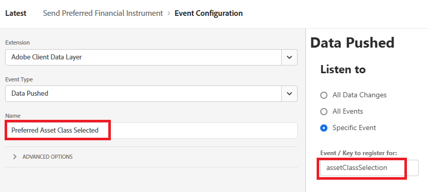

# Adobe Experience Platform 태그 만들기

Adobe Experience Platform 태그(이전의 Adobe Launch)를 사용하면 사이트 코드를 변경하지 않고도 웹 사이트에서 marketing 및 analytics 기술을 관리 및 배포*할 수 있습니다.

이 [비디오에서는 Adobe Experience Tags를 만드는 과정을 설명합니다](https://experienceleague.adobe.com/en/playlists/experience-platform-get-started-with-tags)

* 데이터 수집에 로그인
* Tags -> New Property 클릭
* 재무 어드바이저라는 Adobe Experience Platform 태그를 만듭니다.

* 태그에 다음 확장 추가
  

* 이전 단계에서 생성한 Financial Advisor 데이터 스트림과 올바른 환경을 사용하도록 Adobe Experience Platform Web SDK을 구성해야 합니다.
  

* Adobe 클라이언트 데이터 레이어 및 코어 확장에 대한 추가 구성은 필요하지 않습니다

## 데이터 요소 만들기

데이터 요소는 웹 기반 마케팅 및 광고 기술 전반에서 데이터를 수집, 구성 및 전달하는 데 사용됩니다.

다음 데이터 요소 만들기

| 요소 이름 | 확장 기능 | 데이터 요소 유형 | 추가 주석 |
|------------------------------|-----------------------------------|-------------------|------------------------------------------------------------------------------------------------------------------------------------------------------------------|
| PreferredFinancialInstrument | 코어 | 사용자 지정 코드 | 아래 참고 사항 참조 |
| XDM 개체 | Adobe Experience Platform 웹 SDK | XDM 개체 | 환경 및 Financial Advisor 스키마 선택 |


사용자 지정 코드의 경우 코드 편집기를 열고 다음 코드를 복사하여 붙여넣습니다

```javascript
return window.adobeDataLayer
  ?.slice()
  .reverse()
  .find(event => event.event === "assetClassSelection")
  ?.xdm?.FinancialInterest?.PreferredFinancialInstrument || "undefined";
```

## 코드 설명

웹 페이지에서 발생하는 이벤트를 저장하는 adobeDataLayer 배열을 살펴봅니다.

원본을 변경하지 않도록 .slice() 를 사용하여 배열의 복사본을 만듭니다.

이벤트의 순서를 반대로 하여 최신 이벤트를 먼저 확인합니다.

event.event가 정확히 &quot;assetClassSelection&quot;인 첫 번째 이벤트(최신 항목부터 시작)를 찾습니다.

발견된 경우 해당 이벤트의 xdm 데이터로 이동하여 FinancialInterest.PreferredFinancialInstrument에서 값을 가져옵니다.

찾을 수 없는 경우 &quot;undefined&quot; 문자열을 반환합니다.


## 규칙 만들기

Adobe Experience Platform 태그의 규칙 빌더 를 사용하면 사용자 비헤이비어 또는 이벤트를 기반으로 특정 작업을 웹 사이트에서 실행해야 하는 시기와 방법을 정의할 수 있습니다.

* 기본 설정 금융 상품 보내기라는 규칙을 만듭니다. 이 규칙에는 이벤트와 작업이 포함됩니다


* 아래 표시된 대로 선택된 기본 에셋 클래스 라는 이벤트 구성을 만듭니다. 이 이벤트는 assetClassSelection 이벤트를 수신합니다.
  


* 업데이트된 XDM 스키마를 AEP으로 보내는 작업 만들기
  

* 최종 규칙은 다음과 같아야 합니다
  

## AEP 태그 작성 및 배포


아래 스크린샷에 표시된 대로 새 라이브러리를 만들고 수정된 모든 리소스를 라이브러리에 추가합니다.

라이브러리 추가


라이브러리 만들기

라이브러리 만들기 화면에서 라이브러리 이름과 환경을 지정합니다.
변경된 모든 리소스를 이 라이브러리에 추가해야 합니다.


그런 다음 Save and Build to Development 단추를 클릭하여 라이브러리를 빌드합니다.

## HTML 페이지에 AEP 태그 포함

AEP Tags 속성을 게시하면 Adobe에서 HTML ``` <head>``` 내부 또는 ``` <body>``` 태그의 맨 아래에 배치해야 하는 스크립트 태그를 제공합니다.

* Tags(Financial Advisor) 속성으로 이동합니다.

* 환경 을 클릭하고 원하는 환경의 설치 아이콘(예: 개발, 스테이징, 프로덕션)을 클릭합니다.

* 포함된 코드를 기록합니다. 이 자습서의 이후 단계에서 필요합니다.
