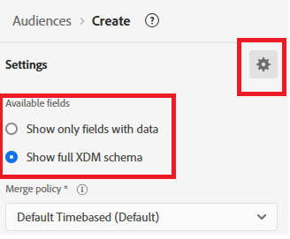

# Adobe Journey Optimizer에서 대상 만들기

Adobe Experience Platform의 대상은 개인화된 경험을 제공하기 위해 작업, 환경 설정 또는 프로필 정보를 기반으로 만들어진 사용자 그룹입니다.

* Journey Optimizer에 로그인
* 고객 -> 대상 ->대상 만들기 로 이동합니다.
* 규칙 작성 방법을 사용하여 대상 만들기

  

* 다음 3개의 대상 만들기

   * 주식에 관심이 있는 고객

   * 채권에 관심이 있는 고객

   * CD에 관심이 있는 고객

* 실시간 자격을 얻으려면 각 대상의 평가 방법이 _**Edge**_(으)로 설정되어 있는지 확인하십시오.
  

* PreferredFinancialInstrument 필드를 사용하여 선택한 투자 이익(예: 주식, 채권 또는 CD)을 기준으로 사용자를 세그먼트화합니다

>[!NOTE]
>
>>이벤트 탭에 PreferredFinancialInstrument 필드가 표시되지 않으면 설정 아이콘을 클릭하고 전체 XDM 스키마 표시 를 토글합니다.

