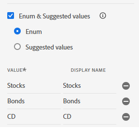
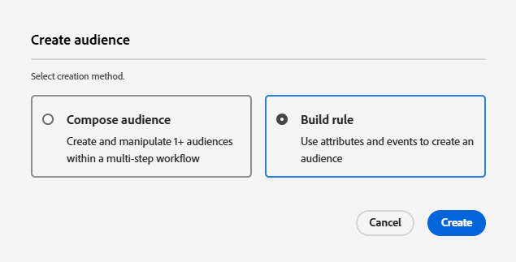

# AEP에서 XDM 스키마, 데이터 세트, 데이터 스트림 및 대상 설정

* Adobe Experience Platform에 로그인

* Journey Optimizer에서 Financial Advisor라는 XDM 이벤트 기반 스키마를 만듭니다. 스키마 만들기에 익숙하지 않은 경우 이 [설명서](https://experienceleague.adobe.com/ko/docs/experience-platform/xdm/tutorials/create-schema-ui)를 따르십시오.

* 스키마에 다음 구조를 추가합니다. PreferredFinancialInstrument 요소는 주식, 채권, CD에 대한 사용자의 선호도를 저장합니다
  

* PreferredFinancialInstrument 요소에 아래와 같이 정의된 열거형 값이 있습니다.
  

* 프로필에 대해 스키마가 활성화되어 있는지 확인합니다.

## 스키마를 기반으로 데이터 세트 만들기

Adobe Experience Platform(AEP)의 **데이터 집합**&#x200B;은(는) 정의된 XDM 스키마를 기반으로 데이터를 수집, 저장 및 활성화하는 데 사용되는 구조화된 저장소 컨테이너입니다.

* 이전 단계에서 만든 XDM 스키마(재무 관리자)를 기반으로 _재무 관리자 데이터 집합_&#x200B;이라는 데이터 집합을 만듭니다.

* 프로필에 대해 데이터 세트가 활성화되어 있는지 확인합니다.

## 데이터 스트림 만들기

Adobe Experience Platform의 데이터 스트림은 웹 사이트 또는 앱을 Adobe 서비스에 연결하는 보안 파이프라인(또는 고속도로)과 유사하므로 데이터가 이동하고 개인화된 콘텐츠가 다시 흐를 수 있습니다.

* AEP > 데이터스트림으로 이동한 다음 새 데이터스트림을 클릭합니다. 데이터 스트림 이름을 _재무 관리자 데이터 스트림_&#x200B;으로 지정합니다.

* 아래 스크린샷과 같이 다음 세부 정보를 제공합니다
  
* 저장 을 클릭한 다음 매핑 추가 를 클릭하고 아래와 같이 Adobe Experience Platform 서비스 및 이벤트 데이터 세트를 추가합니다
  

* 적절한 이벤트 데이터 세트(이전에 만든 데이터 세트)를 선택합니다.

* 데이터스트림 저장

## 대상자 만들기

Adobe Experience Platform의 대상은 개인화된 경험을 제공하기 위해 작업, 환경 설정 또는 프로필 정보를 기반으로 만들어진 사용자 그룹입니다.

* 고객 -> 대상자 로 이동합니다.
* 규칙 작성 방법을 사용하여 대상 만들기

* 이벤트 스키마의 PreferredFinancialInstrument 요소를 사용하여 AJO에서 다음 3개의 대상을 만듭니다.

   * 주식에 관심이 있는 고객

   * 채권에 관심이 있는 고객

   * CD에 관심이 있는 고객

각 대상에 대한 평가 방법이 실시간 자격을 위해 Edge으로 설정되어 있는지 확인합니다.

다음 스크린샷은 대상자를 만드는 데 도움이 될 것입니다.

