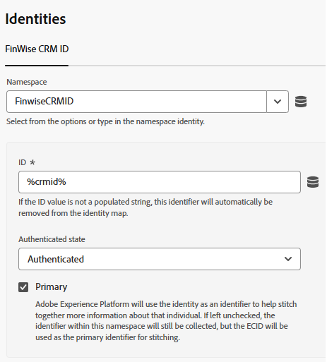
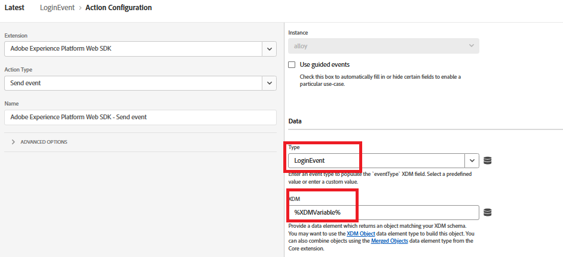

# Adobe Experience Platform으로 CRMID 보내기

Adobe Experience Platform 태그는 ID 데이터를 브라우저에서 직접 전송하는 유연한 이벤트 기반 메커니즘을 제공하므로 CRMID를 Adobe Experience Platform(AEP)로 전송하는 데 사용됩니다. 사용자 로그인 후 CRMID를 전송하면 AEP이 알려진 CRM 프로필과 익명 ECID를 연결하여 정확한 ID 결합을 가능하게 합니다. 이러한 연결은 Adobe Journey Optimizer(AJO)에서 통합 고객 프로필을 구축하고, 대상자를 검증하고, 실시간 개인화된 경험을 제공하는 기반을 형성합니다.

_**FinWise**_(이)라는 Experience Platform Tags 속성이 만들어졌습니다. 다음 확장이 태그 속성에 추가되었습니다

이전 단계에서 만든 재무 관리자 데이터 스트림을 사용하여 AEP Web SDK 확장을 구성합니다.
Experience Cloud ID 서비스 는 디버깅을 위해 태그 속성에 추가된 선택적 확장입니다.

## 태그 데이터 요소

다음 데이터 요소 만들기

| 데이터 요소 | 확장 기능 | 데이터 요소 유형 | 사용자 정의 설정 |
|--------------|-----------------------------------|---------------------------|----------------------------------------|
| crmid | Adobe 클라이언트 데이터 레이어 | 데이터 레이어 계산된 상태 | user.crmid |
| ECID | Experience Cloud ID 서비스 | ECID |                                        |
| ID | Adobe Experience Platform 웹 SDK | ID 맵 |  |
| XDMVariable | Adobe Experience Platform 웹 SDK | 변수 |  |

## 규칙 만들기

다음 이벤트와 작업을 사용하여 LoginEvent라는 규칙을 만듭니다.

이벤트

변수 업데이트 작업

이벤트 보내기 작업

## 저장 및 빌드

변경 사항을 저장하고, 라이브러리를 만들고 빌드합니다.
