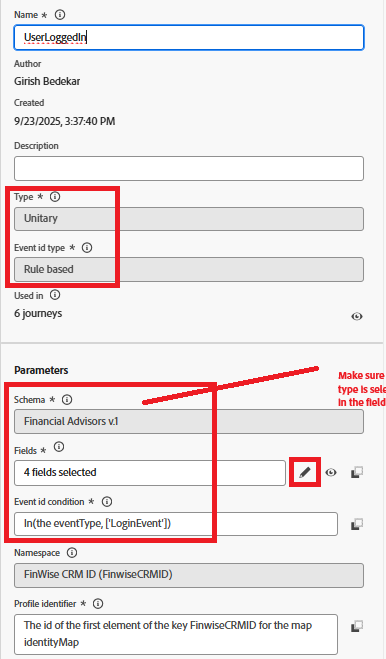

# Adobe Web SDK을 사용하여 Adobe Journey Optimizer 여정 트리거

ID 결합 자습서의 이 확장에서 결합된 프로필을 사용하여 로그인한 사용자에게 이메일을 보내는 Adobe Journey Optimizer 여정이 트리거됩니다. **이 문서에서는 사용자가 전자 메일 채널 및 전자 메일 채널에 대한 콘텐츠를 만드는 방법을 잘 알고 있다고 가정합니다.**

## 전자 메일 채널 구성 만들기

* _&#x200B;**Journey Optimizer**&#x200B;_&#x200B;에 로그인
* _&#x200B;**관리 -> 채널 -> 채널 구성 만들기**&#x200B;_(으)로 이동
* 채널 목록에서 **전자 메일**&#x200B;을(를) 선택하십시오. 의미 있는 이름과 설명을 입력합니다.
* 이메일 설정을 입력합니다.
* 아래와 같이 실행 세부 정보를 제공합니다. 이메일은 필드에 저장된 프로필의 이메일 주소로 전송됩니다
* 
* 이메일 채널 구성 활성화

## 이벤트 만들기

* _&#x200B;**Journey Optimizer**&#x200B;_&#x200B;에 로그인
* _&#x200B;**관리 -> 구성**&#x200B;_(으)로 이동
* 이벤트 카드의 관리 버튼을 클릭하고 이벤트 만들기 를 클릭합니다. 아래와 같이 값을 지정합니다
* 

* 이벤트의 eventType이 LoginEvent인지 확인합니다. `LoginEvent` 형식이 Adobe Experience Platform 태그에 설정되었습니다.
* 이벤트 저장

## 여정 만들기

* _&#x200B;**Journey Optimizer**&#x200B;_&#x200B;에 로그인
* _&#x200B;**여정 관리 -> 여정 -> 여정 만들기**&#x200B;_(으)로 이동
* _&#x200B;**UserLoggedIn**&#x200B;_ 이벤트를 캔버스에 끌어서 놓습니다.
* 작업 메뉴에서 이메일을 끌어다 놓습니다. 이전에 만든 이메일 채널 구성을 사용하도록 이메일 작업을 구성합니다.
* 여정을 게시합니다.

## 여정 트리거 방법

이 여정은 웹 SDK을 통해 전송된 이벤트 페이로드가 여정에 구성된 내용과 일치할 때 트리거됩니다. 이 예제에서 이벤트는 `UserLoggedIn`이고 이벤트 유형은 `LoginEvent`입니다.

* 여정 보고서를 보고 이를 확인합니다
* 

