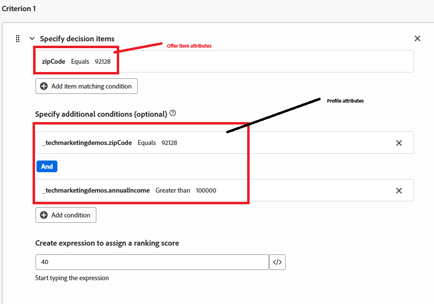

# 순위 공식 만들기

Adobe Journey Optimizer의 순위 공식은 Offer Decisioning 중에 사용되며, 특히 적격 오퍼의 우선 순위를 결정하기 위한 선택 전략 내에서 사용됩니다. 여러 오퍼가 주어진 프로필에 적합하지만 비즈니스 논리 또는 프로필 컨텍스트를 기반으로 최상위 오퍼(또는 일부)만 표시되어야 하는 경우 자격 필터링 후에 순위 공식이 적용됩니다.

* Journey Optimizer에 로그인

* 의사 결정 ->전략 설정 ->등급 수식 ->수식 만들기

순위 공식

등급 공식의 기준은 오퍼에 점수를 할당하는 데 사용되는 조건부 규칙을 나타냅니다. 이러한 기준은 오퍼와 프로필 또는 컨텍스트의 속성을 비교하여 특정 개인에 대한 오퍼의 관련성을 결정합니다.

기준 1

기준 1에는 다음 세 가지 기준이 포함되어 있습니다.

* 오퍼._techmarketingdemos.offerDetails.zipCode == &quot;92128&quot; - 오퍼와 연결된 ZIP 코드를 확인합니다.

* _techmarketingdemos.zipCode == &quot;92128&quot; - 사용자 프로필의 우편번호를 확인합니다.

* _techmarketingdemos.annualIncome > 100000 - 사용자 프로필에서 소득 수준을 확인합니다.

이 기준을 모두 충족하면 오퍼는 40점을 받습니다.

기준 2

기준 2에는 다음 세 가지 기준이 포함됩니다.

* 오퍼._techmarketingdemos.offerDetails.zipCode == &quot;92126&quot; - 오퍼와 연결된 ZIP 코드를 확인합니다.

* _techmarketingdemos.zipCode == &quot;92126&quot; - 사용자 프로필의 우편번호를 확인합니다.

* _techmarketingdemos.annualIncome &lt; 100000 - 사용자 프로필에서 소득 수준을 확인합니다.

이 기준을 모두 충족하면 오퍼는 30점을 받습니다.

