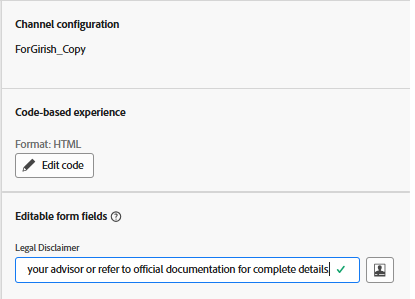

# AJO 코드 기반 경험에서 편집 가능한 양식 필드 사용

많은 마케팅 여정, 특히 규제 대상 산업에서는 캠페인, 지역 또는 제품에 따라 달라질 수 있는 법적 면책조항을 포함해야 합니다. AJO Personalization 편집기에서 직접 [편집 가능한 필드](https://experienceleague.adobe.com/en/docs/journey-optimizer-learn/tutorials/channels/code-based-experience-channel/form-fields-in-code-based-experiences)를 사용하면 마케터와 법률팀이 개발자를 참여시키거나 결정 논리를 수정하지 않고도 면책조항 텍스트에 대한 모든 권한을 유지할 수 있습니다.

이를 통해 오퍼와 같은 결정된 콘텐츠를 활용하면서 캠페인 전반에서 빠른 업데이트와 규정 준수를 보장할 수 있습니다.

## 개인화 편집기에 편집 가능한 필드 삽입

- 이전 단계에서 만든 캠페인을 엽니다.
- _**캠페인 수정**_ 클릭
- _**콘텐츠**_ 탭으로 이동
- _**코드 편집**_&#x200B;을 클릭하고 개인화 편집기에서 다음 구문을 사용하여 기본값이 포함된 legalDisclaimer라는 편집 가능한 필드를 삽입합니다

- 
  <pre><code>&#123;&#123;#inline &quot;legalDisclaimer&quot; name=&quot;Legal Disclaimer&quot;&#125;&#125; Legal Disclaimer will go here &#123;&#123;/inline&#125;&#125;</code></pre>

- <code>{{{legalDisclaimer}}} 사용</code> 아래 표시된 대로 템플릿에 있는 변수

- 

- 마케터는 개인화 편집기를 열지 않고도 법적 고지 사항 필드를 쉽게 편집할 수 있습니다.
- 

## 캠페인 게시

캠페인을 활성화하여 개인화된 오퍼를 실시간으로 제공할 수 있습니다.
