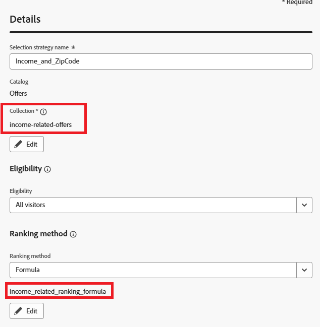

# 선택 전략 만들기

선택 전략은 의사 결정 정책에 전략을 사용할 때 표시되는 오퍼를 결정하기 위해 오퍼 컬렉션과 자격 규칙 및 순위 방법을 결합한 재사용 가능한 구성입니다.

선택 전략을 만들려면

* Journey Optimizer에 로그인

* 의사 결정 ->전략 설정 ->선택 전략 ->선택 전략 생성으로 이동합니다.

* 스크린샷에 표시된 대로 선택 전략 이름, 컬렉션, 자격 요건 및 등급 지정 방법을 제공합니다

등급 방법으로 공식을 사용해야 합니다.

