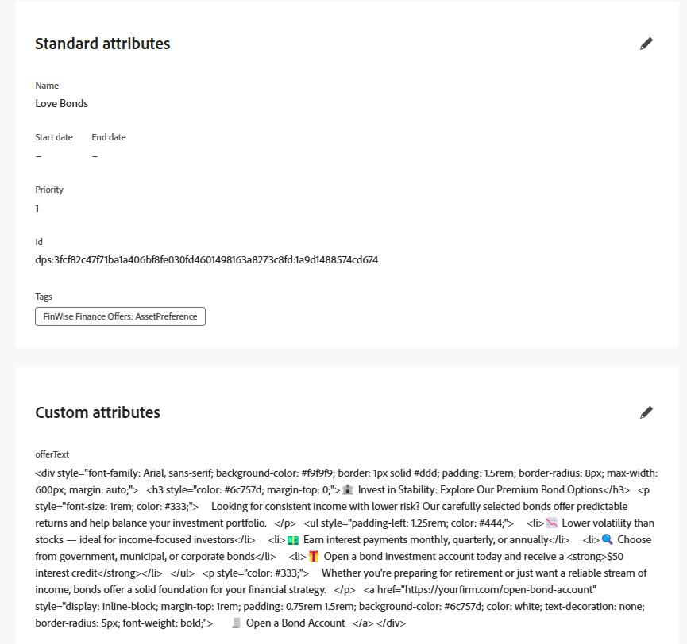

# 오퍼 만들기

AJO의 오퍼 항목은 개인화된 단일 콘텐츠를 나타냅니다. 콘텐츠는 의사 결정 논리에 따라 사용자에게 제공되는 프로모션, 메시지 또는 추천일 수 있습니다.

AJO에서 오퍼 항목을 만들 때 [!UICONTROL 의사 결정 스키마]를 기반으로 해야 합니다. 이 스키마는 제목, 설명, imageURL, offerText 등과 같이 오퍼에서 사용할 수 있는 구조 및 필드를 정의합니다.

이 스키마:

* 컬렉션의 모든 오퍼에 대한 콘텐츠 모델을 표준화합니다.

* 오퍼 항목 간에 일관된 개인화 필드를 허용합니다.

* 규칙을 구조화된 콘텐츠에 일치시키는 선택 전략을 활성화합니다.

## 스키마 수정

1. Journey Optimizer에 로그인.
1. **[!UICONTROL 의사 결정]** > **[!UICONTROL 카탈로그]** > **[!UICONTROL 스키마 편집]**​ì„ 클릭합니다.
1. 아래와 같이 `offerItem`(이)라는 `string` 형식의 요소를 추가합니다.

   

## 오퍼 항목 만들기

1. **[!UICONTROL 의사 결정]** > **[!UICONTROL 카탈로그]** > **[!UICONTROL 항목 만들기]**​를 클릭합니다.

1. `Love Stocks`, `Love Bonds`, `Love CD` 오퍼를 세 개 만듭니다.

   각 오퍼에 대해 이 문서의 끝에 제공된 해당 오퍼 텍스트를 복사하여 해당 오퍼 항목에 붙여넣습니다.

1. 이전 단계에서 생성된 태그로 오퍼에 태그를 지정합니다.

1. 오퍼를 승인합니다.

표준 및 사용자 지정 특성이 정의된 완료된 오퍼:



**Love Stocks offerText**

```html
<div style="font-family: Arial, sans-serif; background-color: #f9f9f9; border: 1px solid #ddd; padding: 1.5rem; border-radius: 8px; max-width: 600px; margin: auto;">   <h3 style="color: #1a73e8; margin-top: 0;">📈 Open a Stock Trading Account & Get $100 in Bonus Stock</h3>   <p style="font-size: 1rem; color: #333;">     Ready to start building your portfolio? Open a new stock trading account with us and receive a      <strong>$100 bonus in stock</strong> — on us.   </p>   <ul style="padding-left: 1.25rem; color: #444;">     <li>🧾 No account minimums — start investing with as little as $1</li>     <li>📉 $0 commissions on online stock trades</li>     <li>📊 Access to powerful trading tools and real-time analytics</li>     <li>🎓 Free educational resources to help you invest confidently</li>   </ul>   <p style="color: #333;">     It's never been easier to start trading. Join thousands of investors who trust us to help them grow their wealth.   </p>   <a href="https://yourbrokerage.com/open-account"      style="display: inline-block; margin-top: 1rem; padding: 0.75rem 1.5rem; background-color: #1a73e8; color: white; text-decoration: none; border-radius: 5px; font-weight: bold;">      🚀 Open Your Account Today   </a> </div>
```

**Love Bonds offerText**

```html
<div style="font-family: Arial, sans-serif; background-color: #f9f9f9; border: 1px solid #ddd; padding: 1.5rem; border-radius: 8px; max-width: 600px; margin: auto;">   <h3 style="color: #6c757d; margin-top: 0;">🏦 Invest in Stability: Explore Our Premium Bond Options</h3>   <p style="font-size: 1rem; color: #333;">     Looking for consistent income with lower risk? Our carefully selected bonds offer predictable returns and help balance your investment portfolio.   </p>   <ul style="padding-left: 1.25rem; color: #444;">     <li>📉 Lower volatility than stocks — ideal for income-focused investors</li>     <li>💵 Earn interest payments monthly, quarterly, or annually</li>     <li>🔍 Choose from government, municipal, or corporate bonds</li>     <li>🎁 Open a bond investment account today and receive a <strong>$50 interest credit</strong></li>   </ul>   <p style="color: #333;">     Whether you're preparing for retirement or just want a reliable stream of income, bonds offer a solid foundation for your financial strategy.   </p>   <a href="https://yourfirm.com/open-bond-account"      style="display: inline-block; margin-top: 1rem; padding: 0.75rem 1.5rem; background-color: #6c757d; color: white; text-decoration: none; border-radius: 5px; font-weight: bold;">      🧾 Open a Bond Account   </a> </div>
```

**CD OfferText 사랑**

```html
<div style="font-family: Arial, sans-serif; background-color: #f9f9f9; border: 1px solid #ddd; padding: 1.5rem; border-radius: 8px; max-width: 600px; margin: auto;">   <h3 style="color: #28a745; margin-top: 0;">💰 Lock in a 5.25% APY — Open Your CD Account Today</h3>   <p style="font-size: 1rem; color: #333;">     Secure your savings with a high-yield Certificate of Deposit. For a limited time, enjoy a      <strong>guaranteed 5.25% annual percentage yield (APY)</strong> on 12-month CDs.   </p>   <ul style="padding-left: 1.25rem; color: #444;">     <li>🔒 Guaranteed returns with FDIC insurance</li>     <li>📈 Lock in today's high rates before they change</li>     <li>💼 Flexible terms from 6 to 24 months</li>     <li>🎁 Open with just $500 and get a $50 bonus</li>   </ul>   <p style="color: #333;">     Whether you're saving for a short-term goal or building a conservative income strategy, our CDs offer peace of mind and predictable growth.   </p>   <a href="https://yourbank.com/open-cd"      style="display: inline-block; margin-top: 1rem; padding: 0.75rem 1.5rem; background-color: #28a745; color: white; text-decoration: none; border-radius: 5px; font-weight: bold;">      💼 Open a CD Account   </a> </div>
```
