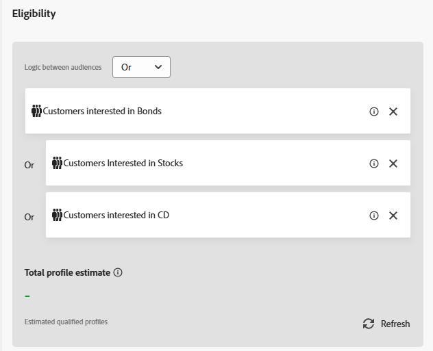

# 선택 전략 만들기

선택 전략은 의사 결정 정책에 전략을 사용할 때 표시되는 오퍼를 결정하기 위해 오퍼 컬렉션과 자격 규칙 및 순위 방법을 결합한 재사용 가능한 구성입니다.

오퍼 선택을 Experience Platform 대상의 구성원으로 제한하려면 대상 을 선택하고 목록에서 대상을 선택합니다. 이 자습서에서는 이전 자습서에서 만든 대상이 사용됩니다.

